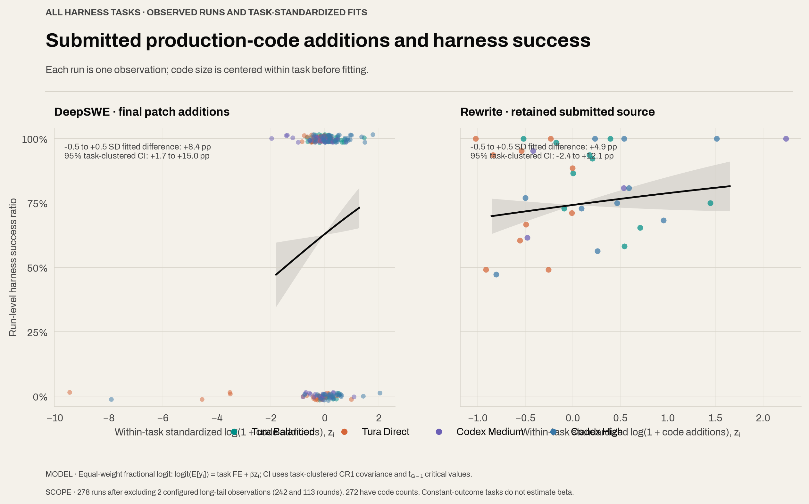
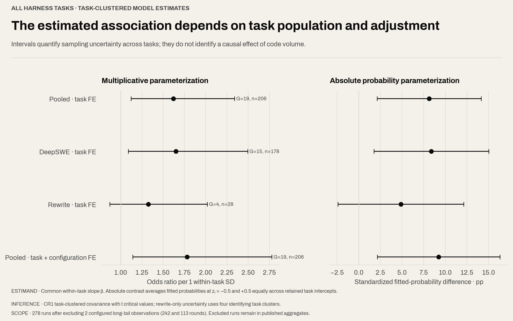

# Benchmark Methodology

## 1. Purpose and scope

This benchmark evaluates coding agents on three complementary forms of long-horizon work:

1. **DeepSWE subset (20 tasks):** repository-level software-engineering tasks selected from DeepSWE v1.1, with balanced language coverage and difficulty stratification.
2. **Rewrite subset (5 tasks):** four open-source command-line tools rewritten from Rust to Python, plus one single-page HTML reference rebuilt as a full-stack TanStack Start application.
3. **Design subset (2 tasks):** open-ended visual and interactive HTML deliverables. These tasks are executed and archived, but are intentionally excluded from the automated scoring harness.

The resulting suite contains **27 tasks in total**. Of these, **25 are harness-scored** and **2 are design-mode tasks without a harness**. The three subsets measure different capabilities and should be reported separately. A single aggregate score is not the primary result because binary repository repair, behavioral compatibility, full-stack reconstruction, and visual design are not commensurate measurements.

This document describes the task-selection criteria, data normalization rules, evaluation boundaries, known anomalies, and limitations. The task inventory, executable contracts, selection logic, and published result artifacts are maintained in this repository; the [current test-set evidence record](current-test-set-record.md) applies the methodology to the July 2026 artifacts.

### 1.1 Research questions and estimands

The primary unit of comparison is the complete configured agent system. The
four-configuration matrix evaluates outcome and resource measurements jointly;
it does not estimate an isolated runtime-component effect.[^tura-repository]

| Analysis question                | Primary estimand                                                                                               | Required controls or qualifications                                                                                                                     |
| -------------------------------- | -------------------------------------------------------------------------------------------------------------- | ------------------------------------------------------------------------------------------------------------------------------------------------------- |
| Configuration outcome            | DeepSWE pass proportion; rewrite task-macro and assertion-micro rates                                          | Report numerator, denominator, task revision, replicate count, model, effort, build, and retry policy                                                   |
| Resource allocation              | Observed tokens, rounds, estimated cost, and command records                                                   | Keep token components separate; command records are runtime-specific units                                                                              |
| Additional reasoning effort      | Codex High-minus-Medium configuration contrast                                                                 | Build and effort differ simultaneously; the contrast is not an effort-only effect                                                                       |
| Round and command associations   | Q1-to-Q3 difference in fitted success probability                                                              | Descriptive binomial models; task difficulty and stopping behavior remain uncontrolled                                                                  |
| Submitted production-code volume | Within-task association between code additions and run-level harness success ratio across all 25 harness tasks | Equal run weights; task fixed effects; task-clustered uncertainty; configuration-adjusted and subset sensitivity models; missing source remains missing |

Tura Balanced operationalizes the verification-reinvestment configuration and
Tura Direct operationalizes the token-and-round-reduction configuration. Their
labels identify configured policies; they do not encode a success criterion.
Every comparison reports harness outcome, observed model tokens, model rounds,
estimated cost when usage is available, and the relevant uncertainty or
identification limit.

This matrix is not a feature-level ablation. Runtime architecture, tool
orchestration, context policy, reasoning effort, instructions, and verification
behavior vary jointly. A component-level causal estimand requires a crossed
design that holds the remaining factors constant.

## 2. Design principles

The suite follows six principles.

- **Behavior before implementation shape.** Where an automated verifier is available, success is based on observable behavior rather than matching a reference patch or reproducing internal symbol names. This follows the behavioral-verifier rationale described by DeepSWE and the broader repository-level evaluation setup established by SWE-bench.[^deepswe-methodology] [^swebench-paper]
- **Coverage before convenience.** DeepSWE sampling is stratified by programming language and estimated difficulty rather than drawn only from the easiest or most common tasks.
- **Pinned, auditable inputs.** Rewrite tasks identify the source repository, commit, tag, target language, and stable harness items. Run artifacts retain task, agent, model, and runtime metadata.
- **No invented evidence.** Missing logs, assertion text, token fields, or scores remain missing. They are not reconstructed from model summaries or inferred from nearby runs.
- **Separate objective and subjective evaluation.** Deterministic or programmatic checks belong in the harness. Design quality remains outside the harness until a validated human-review or multimodal-evaluation protocol is defined.
- **Strategy before feature attribution.** Interpret each agent configuration as a complete budget-and-verification policy. Do not relabel a system-level result as evidence that one architectural component caused it.

These choices are also consistent with reproducible benchmark practice: the experimental design, software versions, parameters, and result metadata should remain tied together rather than being reported as disconnected tables.[^summarized-benchmark]

## 3. Dataset composition

| Subset              |  Tasks | Primary capability                                                      | Evaluation mode                                      | Included in harness aggregate |
| ------------------- | -----: | ----------------------------------------------------------------------- | ---------------------------------------------------- | ----------------------------- |
| DeepSWE v1.1 subset |     20 | Repository exploration, implementation, debugging, and verification     | Official program-based verifier; binary task outcome | Yes                           |
| Rewrite subset      |      5 | Behavioral compatibility, source porting, and full-stack reconstruction | Task-specific multi-item harness                     | Yes                           |
| Design subset       |      2 | Visual communication, research, interaction, and artifact quality       | Artifact capture and separate review                 | No                            |
| **Total**           | **27** | Mixed long-horizon agent work                                           | Mixed                                                | **25 scored, 2 unscored**     |

The suite is a **curated capability sample**, not a random sample of all software-engineering work. Results therefore support comparison on this fixed suite; they do not directly estimate performance on all repositories, languages, or development tasks.

## 4. DeepSWE subset

### 4.1 Source data

DeepSWE v1.1 contains 113 original tasks across 91 active open-source repositories and five languages: Go, Python, TypeScript, Rust, and JavaScript.[^deepswe-home] [^deepswe-methodology] The official repository publishes the underlying task definitions.[^deepswe-repository] Each task provides an instruction, a pinned environment, resource limits, and a purpose-written verifier in the Harbor task format.[^harbor-tasks]

The subset-selection artifact records these official inputs:

- task metadata: `https://deepswe.datacurve.ai/artifacts/v1.1/tasks.json`;
- trial records: `https://deepswe.datacurve.ai/artifacts/v1.1/trials.json`;
- official task count at selection time: **113**;
- eligible official scored trials at selection time: **18,396**;
- selection schema: `tura.benchmark.deep-swe-selection.v1`.

Only official trials satisfying all three conditions are used to estimate task difficulty:

```text
source == "deep-swe"
eval_scope == "full"
included_in_score == true
```

For task \(t\), the official completion rate is:

```text
official_completion_rate(t)
  = number of eligible official trials with passed == true
    / number of eligible official trials for t
```

In the repository and official artifacts this quantity is named `official_pass_rate`. This document uses **completion rate** and **pass rate** synonymously only for that field. It is a historical empirical rate over the official model/trial pool, not an intrinsic property of the task.

### 4.2 Language balance

The subset contains exactly four tasks from each official language:

| Language   | Selected tasks |
| ---------- | -------------: |
| Go         |              4 |
| Python     |              4 |
| TypeScript |              4 |
| Rust       |              4 |
| JavaScript |              4 |

This equal allocation prevents the larger language pools from dominating the suite. It is a deliberate macro-balancing choice, not a reflection of language prevalence in production software.

### 4.3 Difficulty targets and operational selection

The intended difficulty profile is four levels per language, anchored where possible around **80%, 60%, 40%, and 20% official completion rates**. Higher historical completion implies an easier task; lower completion implies a harder task.

The original inventory was produced with rank bands because some language pools are too small or do not contain tasks near every target rate:

1. rank all eligible tasks within each language by descending official pass rate;
2. divide that language-specific ranking into four approximately equal bands;
3. label the bands `easy`, `medium-easy`, `medium-hard`, and `hard`;
4. select the highest-pass-rate task in each band;
5. break equal-rate ties deterministically by task ID.

This produced four tasks per language and five tasks per difficulty band. The 20/40/60/80 values are therefore **difficulty anchors, not guaranteed bins**. The selected 20 task IDs are now pinned in [`deep_swe/canonical_tasks.json`](../deep_swe/canonical_tasks.json). Current official trial data may refresh the recorded rates and ranks, but it must never change task membership. This prevents later updates to the online `trials.json` artifact from silently changing the comparison cohort.

The selected rates demonstrate the resulting approximation:

| Language   | Selected official completion rates, hard to easy |
| ---------- | ------------------------------------------------ |
| Go         | 44%, 59%, 70%, 80%                               |
| Python     | 36%, 51%, 60%, 87%                               |
| TypeScript | 26%, 36%, 69%, 91%                               |
| Rust       | 13%, 44%, 59%, 61%                               |
| JavaScript | 25%, 30%, 66%, 73%                               |

Rates in this summary are rounded to the nearest percentage point for readability. Selection and auditing use the unrounded values.

### 4.4 Complete DeepSWE task inventory

| Language   | Difficulty band | Official pass rate | Task                                                  | Requested behavior                                            |
| ---------- | --------------- | -----------------: | ----------------------------------------------------- | ------------------------------------------------------------- |
| Go         | Easy            |             79.88% | `actionlint-action-pinning-lint`                      | Add action-pinning linting for actions and reusable workflows |
| Go         | Medium-easy     |             70.12% | `abs-stepped-slices`                                  | Add stepped slices for arrays and strings                     |
| Go         | Medium-hard     |             59.15% | `yaegi-go-embed-directives`                           | Add `go:embed` directive support for interpreted packages     |
| Go         | Hard            |             44.38% | `dasel-html-document-format`                          | Add HTML document-format handling to Dasel                    |
| Python     | Easy            |             87.20% | `narwhals-rolling-window-suite`                       | Add rolling minimum, maximum, median, and quantile methods    |
| Python     | Medium-easy     |             59.88% | `numba-stencil-boundary-modes`                        | Add boundary modes to `@stencil`                              |
| Python     | Medium-hard     |             50.61% | `bandit-incremental-cache-control`                    | Add incremental cache controls to Bandit                      |
| Python     | Hard            |             35.58% | `langchain-request-coalescing`                        | Add request coalescing to `Runnable`                          |
| TypeScript | Easy            |             91.46% | `happy-dom-abort-pending-body-reads`                  | Abort pending body reads on shutdown                          |
| TypeScript | Medium-easy     |             69.14% | `dynamodb-toolbox-conditional-attribute-requirements` | Add conditional required attributes to schemas                |
| TypeScript | Medium-hard     |             35.63% | `awilix-async-container-initialization`               | Add dependency-aware asynchronous container initialization    |
| TypeScript | Hard            |             25.77% | `quill-shared-toolbar-focus`                          | Reuse one toolbar across multiple Quill editors               |
| Rust       | Easy            |             60.98% | `wasmi-trap-coredumps`                                | Add trap coredump generation to wasmi                         |
| Rust       | Medium-easy     |             59.26% | `fd-deterministic-multi-key-sorting`                  | Add deterministic multi-key sorting to fd                     |
| Rust       | Medium-hard     |             44.03% | `boa-hierarchical-evaluation-cancellation`            | Add hierarchical evaluation cancellation to Boa               |
| Rust       | Hard            |             12.80% | `pest-character-class-coalescing`                     | Coalesce qualifying choices into character classes            |
| JavaScript | Easy            |             73.17% | `yjs-map-conflict-detection`                          | Add deterministic map-conflict detection to `Y.Map` writes    |
| JavaScript | Medium-easy     |             65.64% | `testem-per-launcher-reports`                         | Partition reports by launcher and expand report templates     |
| JavaScript | Medium-hard     |             29.81% | `csstree-shorthand-expansion-compression`             | Add shorthand expansion and compression to the lexer          |
| JavaScript | Hard            |             24.54% | `katex-multicolumn-array-spans`                       | Add `\multicolumn` column spans to array-like environments    |

Each selected task had between 159 and 164 eligible official trials in the captured v1.1 data. The selection artifact recorded zero official error trials for these 20 tasks after applying the eligibility filter.

### 4.5 Execution and scoring

Each run starts from the task's pinned base commit and isolated environment. The agent receives the task instruction and edits the workspace. The official task verifier then evaluates the resulting repository state. Pier provides the upstream workspace-and-trace execution model for Harbor tasks, while the local benchmark repository normalizes agent runs and verifier artifacts into its own contracts.[^pier-repository] A valid verifier report with reward `1` is a pass; a valid report with reward `0` is a task failure.

Infrastructure outcomes are not task failures. A non-zero verifier process exit, missing report, malformed reward, unavailable image, workspace-preparation failure, timeout outside the task contract, or artifact-write failure is labeled **invalid/infrastructure failure** and excluded from the pass-rate denominator until rerun or explicitly reported as missing. Treating infrastructure failures as zero would confound agent capability with benchmark availability.

## 5. Rewrite subset

### 5.1 Selection criteria

The rewrite subset is designed to test whether an agent can recover and reproduce behavior from an existing artifact or codebase rather than implement a narrowly localized issue. The repository and result category is named `rewrite`; “rebuild” describes the work performed inside these tasks, not a separate benchmark subset. A task is included when it has:

- a legally accessible and inspectable source or reference artifact;
- a pinned source commit/tag or benchmark-owned reference snapshot;
- a concrete target technology;
- a runnable, task-specific harness with stable score-item IDs;
- enough behavioral breadth to require exploration, implementation, and testing rather than a one-file patch;
- no dependency on private credentials or proprietary services for core scoring.

The four CLI tasks use differential or reference-equivalence checks: the target implementation is exercised with representative commands and compared with the pinned reference behavior. The HTML task combines structural, browser, backend, database, test, and maintainability checks. Harness item counts describe the number of stable assertions, not five directly comparable percentage scales.

### 5.2 Complete rewrite task inventory

| Task                                        | Source and pin                                                                                                                                 | Target                      | Harness items | Scope                                                                                                                                                                                                                                                                                                                                                        |
| ------------------------------------------- | ---------------------------------------------------------------------------------------------------------------------------------------------- | --------------------------- | ------------: | ------------------------------------------------------------------------------------------------------------------------------------------------------------------------------------------------------------------------------------------------------------------------------------------------------------------------------------------------------------ |
| `eza`                                       | [eza](https://github.com/eza-community/eza), Rust, tag `v0.23.3`, commit `05d20d11c488b2ad3f0d63ac0b529281cc1c16ef`                            | Python CLI                  |            52 | Rebuild directory listing, long view, tree traversal, sorting, hidden-file behavior, and related option/error semantics; icons and colors are disabled to keep output comparable.                                                                                                                                                                            |
| `nushell`                                   | [Nushell](https://github.com/nushell/nushell), Rust, tag `0.106.1`, commit `682d593d3f53e5337dceedf98c9603a698af6a64`                          | Python CLI                  |            48 | Reproduce the selected `nu -c` workflow: expressions, tables, JSON, CSV, strings, mathematics, and filesystem snippets. This is a compatibility subset, not a full Nushell reimplementation.                                                                                                                                                                 |
| `xsv`                                       | [xsv](https://github.com/BurntSushi/xsv), Rust, tag `0.13.0`, commit `2b4cbaa0eecf7b507a612632fe00289b1b358c15`                                | Python CLI                  |            55 | Rebuild CSV behavior for headers, count, select, slice, search, sort, table, format, statistics, and frequency operations, including relevant argument and output semantics.                                                                                                                                                                                 |
| `zip-password-finder`                       | [zip-password-finder](https://github.com/agourlay/zip-password-finder), Rust, tag `v0.11.1`, commit `7c1a4c93841220fc740ed81d3b97784e450fc6a6` | Python CLI                  |            18 | Rebuild the single-command interface, argument validation, dictionary search, and brute-force ZIP password search behavior.                                                                                                                                                                                                                                  |
| `prompt-gallery-tanstack-fullstack-rebuild` | Benchmark-owned `makeup.html`, snapshot tag `report-20260708-20260709`                                                                         | TypeScript / TanStack Start |            63 | Convert a single-page prompt-marketplace reference into a functioning full-stack application. Checks cover TanStack Start structure, visual fidelity, storefront/detail/cart/checkout/filter/favorite/creator/admin flows, server operations, local database schema and seed data, computed analytics, runnable tests, browser robustness, and code quality. |

### 5.3 Rewrite scoring

Each task reports passed assertions and total valid assertions from its own harness. Recommended reporting is:

```text
task_score = passed valid harness items / total valid harness items
```

For replicated runs, pool valid harness items within each task before computing that task's score. Report both the numerator and denominator. The task-level macro average gives each of the five tasks equal weight:

```text
rewrite_macro_average = mean(task_score for the five rewrite tasks)
```

The published README also reports an assertion-weighted micro rate from the canonical manifest:

```text
rewrite_micro_rate = sum(passed valid harness items) / sum(total valid harness items)
```

Keep the macro and micro rates labeled and adjacent. The micro rate gives the 63-item HTML rebuild 3.5 times the weight of the 18-item ZIP task merely because its harness is more granular; it is useful as an auditable count of all checks, but it is not a task-balanced score. Never average run percentages directly.

The harness does not require source-level similarity. Alternative implementations are acceptable when they satisfy the declared behavior. Conversely, compilation or visual resemblance alone is insufficient when behavioral checks fail.

### 5.4 Published run matrix

The July 2026 rewrite publication contains five tasks, four configurations, and
two replicates per configuration: 40 canonical runs. The 30-run Tura Balanced,
Tura Direct, and Codex Medium source is
[`report-20260710-gpt56-sol`](../results/rewrite/report-20260710-gpt56-sol/canonical-manifest.json).
The 10-run Codex High source is
[`report-20260714-codex-cli-0.144.1-gpt56-sol-high`](../results/rewrite/report-20260714-codex-cli-0.144.1-gpt56-sol-high/canonical-manifest.json).
Per-run prompts, normalized rounds, aggregate usage, retained workspaces, and
harness reports remain under those report directories.

## 6. Submitted production-code volume analysis across harness tasks

The secondary research question applies to all 25 harness-scored tasks: within
the same task, is a larger submitted production-code volume associated with a
higher expected run-level harness success ratio? The exposure is submitted
production-code additions, defined separately at the stable artifact boundary
for each task class:

- **DeepSWE:** added lines reported by `git apply --numstat` for the final patch,
  restricted to production `.go`, `.py`, `.pyi`, `.js`, `.jsx`, `.ts`, `.tsx`,
  `.mjs`, `.cjs`, and `.rs` files;
- **rewrite:** physical lines in retained submitted production source, treated
  as additions from an empty target; the TanStack task uses the archived
  evaluator `source_lines` field.

Exclude tests, specs, fixtures, harnesses, benchmarks, examples, reference
source, and test/verify helpers. Missing source remains missing rather than
zero. In the declared 278-run relationship population, code volume is observed
for all 238 DeepSWE runs and 34 of 40 rewrite runs, for 272 observations.

For run `i` in task `t`, define

`z_i = [log(1 + additions_i) - median_t(log(1 + additions))] / s_within`,

where `s_within = 0.33631` is the pooled standard deviation after within-task
median centering. This transformation permits zero additions and prevents raw
patch line counts from being interpreted on the same scale as a greenfield
rewrite.

Let `y_i = passed_i / checks_i`. Fit an equal-run-weight fractional-logit model:

`logit(E[y_i]) = α_t + β z_i`,

where `α_t` is a task fixed effect. Each run contributes one quasi-likelihood
observation regardless of its harness item count; rewrite tasks therefore do
not dominate DeepSWE merely because their harnesses contain more assertions.
Tasks with no observed outcome variation remain in descriptive displays but do
not identify `β`.

Report four predeclared specifications: pooled task fixed effects, DeepSWE-only
task fixed effects, rewrite-only task fixed effects, and pooled task plus
configuration fixed effects. Report `exp(β)` and the standardized fitted
probability difference between `z = -0.5` and `z = +0.5`, averaging retained
task intercepts equally. Construct two-sided 95% intervals from a CR1 sandwich
covariance clustered by task and a `t_(G-1)` critical value, where `G` is the
number of identifying task clusters. The rewrite-only specification has four
identifying clusters and must be interpreted as low precision.

<p align="center">
  
</p>

_Method figure 1. The 278-run relationship population excludes two Tura
Balanced observations above 90 rounds (113 and 242), both retained in published
aggregates; 272 runs have observed code volume. The panels show run-level
outcomes and subset-specific task-fixed-effect fractional-logit fits. Six
unavailable rewrite source bodies remain missing._

<p align="center">
  
</p>

_Method figure 2. The same 278-run population and two-run exclusion apply; 272
runs have observed code volume. Odds-ratio and standardized
probability-difference estimates use 95% CR1 task-clustered intervals. The
complete run-level data, task table, coefficients, covariance matrices,
exclusions, and missing-source IDs are published in
[`assets/harness-code-statistics`](../assets/harness-code-statistics/)._

## 7. Design subset

### 7.1 Why design tasks are outside the harness

The design tasks have stable prompts, run metadata, and required output paths, but no `harness.json`. They are excluded from automated score aggregation because their central outcomes—visual hierarchy, information design, editorial quality, interaction clarity, and responsible use of sources—cannot currently be reduced to the same deterministic pass/fail contract used by the engineering tasks.

Simple existence checks such as “`index.html` was created” are useful integrity checks but are not evidence of design quality. Until a separate rubric is validated, these tasks should be reported as **completed artifact / invalid artifact / not run**, followed by blinded human review or clearly labeled qualitative analysis. They must not silently receive a zero or a perfect score in the 25-task harness result.

### 7.2 Complete design task inventory

| Task                              | Required deliverable                                                  | Core requirements                                                                                                                                                                                                                                                                                                      | Evaluation boundary                                                                                                                                                                |
| --------------------------------- | --------------------------------------------------------------------- | ---------------------------------------------------------------------------------------------------------------------------------------------------------------------------------------------------------------------------------------------------------------------------------------------------------------------- | ---------------------------------------------------------------------------------------------------------------------------------------------------------------------------------- |
| `east-asian-squid-recipes-slides` | A navigable English HTML presentation at `./index.html`               | Fifteen illustrated slides covering ten distinct squid cooking methods from East Asian countries or regions; each method needs cultural attribution, ingredient quantities, preparation and cooking steps, timing, a recipe-source link, and a working YouTube cooking-video link; all assets remain in the workspace. | Review completeness, factual sourcing, editorial structure, image relevance, readability, navigation, and link validity. No automated harness score.                               |
| `paris-summer-temperature-3d`     | A responsive English interactive 3D HTML experience at `./index.html` | Show the evolution of Paris summer temperature from 1986 through 2026 with a clear time axis, spatial depth, animation, and controls for yearly values, trends, and notable heat events; keep assets local and distinguish observed historical values from provisional or projected 2026 values.                       | Review data provenance, historical/provisional labeling, legibility, interaction stability, 3D communication value, responsiveness, and accessibility. No automated harness score. |

## 8. Data organization and normalization

### 8.1 Immutable task identity

Every task is keyed by a stable task ID. Repository tasks additionally retain the repository URL and base commit. Rewrite tasks retain their source tag/commit and target runtime. Results from different task revisions must not be merged under one ID without a revision field or migration record.

### 8.2 Run identity and repeats

A run record should include at least:

- benchmark and task version;
- task ID and subset;
- agent/runtime ID;
- model identifier and reasoning/effort setting;
- replicate number;
- start/end state and bounded timeout;
- source commit or reference snapshot;
- harness version and report path, when applicable;
- observable token/usage fields without imputation;
- infrastructure status and retry lineage.

Agentic runs are stochastic. Replicates are independent observations, not
backup files to be cherry-picked. Retry only a documented environment failure
or provider failure that invalidates the attempt. A normal task timeout, agent
non-zero exit, agent-reported error, or valid verifier failure is experimental
behavior and must remain in the dataset without retry.

### 8.3 Raw, normalized, and published layers

- **Raw layer:** untouched provider events, stdout/stderr, workspace state, and verifier output.
- **Normalized layer:** schema-validated rounds, tool calls, usage, task reports, and harness reports.
- **Published layer:** compact manifests and result tables linked back to normalized and raw evidence.

Normalization may rename or structure fields, but it must not invent commands, tool results, token counts, assertions, or scores. Cumulative usage updates must be deduplicated before summation; otherwise repeated provider snapshots inflate cost and token totals.

#### 8.3.1 Codex CLI instrumentation and publication boundary

Codex Medium used a locally instrumented Codex build to retain round commands,
timing, and provenance. Its normalized round contracts omit per-round input and
output components, while run-level aggregate usage remains retained. Codex
High used the unmodified official Codex CLI `0.144.1` release. Keep the two
configurations separate in every table and fit. The build boundary is a
confounder; do not attribute a High-versus-Medium difference solely to
reasoning effort.

### 8.4 Missing and malformed data

Use explicit states rather than coercing all anomalies to zero:

| Condition                                                                          | Treatment                                                             |
| ---------------------------------------------------------------------------------- | --------------------------------------------------------------------- |
| Valid harness reward or assertion result                                           | Include in task score                                                 |
| Agent completed; valid verifier returns failure                                    | Count as task failure                                                 |
| Agent process or task reaches its declared task timeout and verifier can still run | Preserve timeout status and score only from the valid verifier        |
| Agent process times out or exits non-zero                                          | Retain as experimental behavior; do not retry                         |
| Provider or environment failure invalidates the attempt                            | Mark invalid and retry with lineage retained                          |
| Verifier crashes, report is absent/malformed, or source cannot be prepared         | Mark invalid/infrastructure failure; do not count as task failure     |
| Token or cost field unavailable                                                    | Keep null/missing; do not estimate                                    |
| Assertion text absent in an archived report                                        | Keep evidence text empty; retain stable assertion ID if known         |
| Duplicate cumulative provider-usage event                                          | Deduplicate using the cumulative state before aggregation             |
| Design artifact missing or entry path wrong                                        | Mark invalid artifact; do not manufacture a design score              |
| External link unavailable during design review                                     | Record link-check time and failure separately from artifact rendering |

### 8.5 Analysis populations and declared exclusion

Configuration-level result tables use all 280 published harness-scored runs.
Cross-run relationship figures use a 278-run population after excluding exactly
two Tura Balanced observations above 90 rounds: 113 rounds for
`quill-shared-toolbar-focus` and 242 rounds for
`dynamodb-toolbox-conditional-attribute-requirements`. The observations remain
in raw contracts and configuration-level aggregates. Record their identities,
values, and exclusion reason in `assets/model-run-statistics/excluded-runs.csv`.
Do not apply additional visual trimming or replace missing values with zero.

The threshold changes the estimand from the full empirical population to the
declared non-long-tail relationship population. Every statistical figure and
caption must state the 278-run denominator and the two-run exclusion. The
submitted-code analysis additionally states its 272-run observed-code
population, 206-run pooled identifying population, task-cluster counts, and six
missing-source records.

## 9. Reporting protocol

### 9.1 Primary metrics

Report the three subsets separately:

- **DeepSWE:** passes / valid task runs and pass rate, with replicate-level results retained;
- **Rewrite:** assertion score per task, the five-task macro average, and the separately labeled assertion-weighted micro rate;
- **Design:** artifact validity and separate rubric dimensions or qualitative findings, explicitly labeled non-harness.

For every strategy comparison, report these outcome metrics beside observed total model tokens, model rounds, and computed cost when the provider usage record supports it. Also retain task-level distributions and severe long tails; aggregate savings alone can hide expensive failures. Verification activity may be summarized from traceable test, build, lint, browser, link, source, or rerun evidence, but raw command counts must not be treated as equal atomic work units across runtimes with different batching granularity.

For comparisons between agents, use the same task revision, model where the agent comparison requires it, effort setting, timeout policy, network policy, and replicate count. Publish the run matrix before interpreting differences.

### 9.2 Statistical reporting contract

For every regression analysis, state the analysis population, response,
predictor transformation, weighting or trial denominator, adjustment variables,
estimand, interval construction, missing-data treatment, and exclusion rule.
Report coefficients only with their units or transformations. Report fitted
probability differences in percentage points and odds ratios as `exp(β)`.

Round and command models use separate binomial logistic regressions by
configuration: `logit(P(success_i)) = α + β log(1 + x_i)`. Their estimand is the
Q1-to-Q3 change in fitted success probability within that configuration's
observed predictor range. Harness check count supplies the binomial trial
denominator; it is not a semantic-difficulty weight.

Token volume uses pooled quadratic OLS on the natural round axis. Effective
billed rate is `cost × 1,000,000 / total tokens` and uses pooled log-linear OLS.
These pooled coefficients combine within- and between-configuration variation.
Command counts are not compared as equal atomic-work units across runtimes.

The submitted-code model uses one equal-weight fractional-logit observation per
run, task fixed effects, and CR1 covariance clustered by task. Its primary
estimand is the common within-task association between standardized
`log(1 + additions)` and expected harness ratio. Report pooled, DeepSWE-only,
rewrite-only, and task-plus-configuration specifications together. The
association remains vulnerable to attempt-scope, architecture, stopping-rule,
and semantic-coverage confounding and is not a causal effect of writing more
lines.

Configuration differences are system-level contrasts. A component-level causal
claim requires a crossed design. Codex High versus Medium is jointly confounded
by build and reasoning effort.

### 9.3 Optional overall summaries

If an overall engineering score is required, use a task-level macro average over the **25 harness-scored tasks** so that each task contributes equally after its own harness has produced a task score. Label the formula and keep the subset scores adjacent. Do not include the two design tasks unless a separate, predeclared scoring protocol exists.

### 9.4 Uncertainty

Always show counts with percentages. Regression figures report 95% intervals
and identify their covariance estimator, clustering unit, and reference
distribution. Round and command intervals are model-based and do not correct
for task dependence. Submitted-code intervals use CR1 covariance clustered by
task but still rely on only 19 pooled, 15 DeepSWE, or 4 rewrite identifying
clusters. Twenty DeepSWE tasks and five rewrite tasks do not support precise
population generalization beyond the curated subset. The official DeepSWE site
likewise reports uncertainty and cautions against overinterpreting small
qualitative frequencies.[^deepswe-home] [^deepswe-methodology]

## 10. Anomalies and edge cases

### 10.1 Difficulty is empirical and model-pool dependent

The official pass rate depends on the models, agent harness, effort settings, and trial mix present in the v1.1 official records. A task labeled hard may be easy for a later model, and a low rate can partly reflect verifier or environment friction. Difficulty labels should be regenerated or versioned when the official trial pool changes.

### 10.2 Sparse language pools distort target rates

Go and Python offered 34 eligible tasks each and TypeScript 35, but Rust and JavaScript offered only five each in the captured selection. Four strata over five candidates cannot closely match four fixed completion-rate targets. Equal language representation is preserved at the cost of a less uniform difficulty profile.

### 10.3 Rank-band boundary effects

Selecting the first item in each rank band is deterministic but sensitive to small rate changes near a band boundary. It also tends to select the easier edge of every band. A future revision could predeclare nearest-target matching with uniqueness constraints, but changing the algorithm would define a new subset version and should not retroactively alter existing results.

### 10.4 Unequal verifier granularity

One harness item can represent a narrow argument check or a broad browser flow. Assertion counts are therefore not units of semantic difficulty. This is why task-level macro aggregation is preferred over pooling all assertions.

### 10.5 Environment and platform sensitivity

CLI output can vary with operating system, locale, filesystem ordering, path separators, terminal capabilities, timestamps, permissions, and archive libraries. Fixtures should disable irrelevant color/icon output, pin locale and dependency versions, normalize only declared nondeterministic fields, and preserve exit code, stdout, and stderr semantics.

### 10.6 Network and source drift

Repositories, package registries, videos, recipe pages, and climate-data endpoints can change or disappear. Source commits and local task assets must be pinned where licensing permits. External-link checks should record their date; link rot is not automatically an agent failure if the artifact used a valid source at run time.

### 10.7 Verifier incompleteness

Program-based verifiers approximate a specification; they are not the specification itself. They can miss valid alternative behaviors or permit incomplete implementations. DeepSWE's authors explicitly motivate behavioral verification and also identify verifier design as an area for continued improvement.[^deepswe-methodology] Harness changes require versioning and re-evaluation of comparability.

### 10.8 Design-review subjectivity

Human design ratings can vary with reviewer background, display, browser, cultural familiarity, and aesthetic preference. Any future design comparison should use multiple blinded reviewers, a predeclared rubric, calibrated examples, and inter-rater agreement. Automated visual checks may detect clipping or missing assets, but should not be presented as a complete measure of quality.

## 11. Limitations and threats to validity

### 11.1 Construct validity

The benchmark measures performance under specific prompts, tools, timeouts, environments, and verifiers. It does not fully measure maintainability, security, product judgment, long-term operation, collaboration, or whether a patch would be accepted by upstream maintainers.

### 11.2 External validity

DeepSWE covers five languages but excludes major ecosystems such as Java and C++. Its official corpus is concentrated in TypeScript, Go, and Python, and is drawn from established open-source repositories; DeepSWE's authors note these same coverage limits.[^deepswe-methodology] Equal-language sampling further differs from real-world language prevalence.

The rewrite subset is small and intentionally heterogeneous. All four CLI ports begin with Rust sources and target Python, so the result should not be generalized to arbitrary language pairs. The HTML task tests one framework and one product shape.

### 11.3 Selection bias

The DeepSWE subset is stratified, not random. It overrepresents Rust and JavaScript relative to their available task pools and chooses deterministic band-edge examples. The rebuild and design tasks were purposefully selected for breadth and evaluability. Reported performance is conditional on this curation.

### 11.4 Contamination

DeepSWE reduces direct benchmark leakage by using original tasks rather than fixes copied from existing public commits.[^deepswe-methodology] This lowers but does not eliminate contamination: models may have seen the underlying repositories, libraries, task descriptions after publication, or similar implementations. Research on code-generation benchmarks finds that both surface and semantic overlap with training corpora can materially inflate measured performance.[^contamination-paper]

The four rebuild sources are public and may be present in model training data. They should be interpreted as behavioral reconstruction tasks, not contamination-free tests of novel algorithm discovery.

### 11.5 Temporal validity

Model APIs, agent implementations, package registries, benchmark artifacts, and source repositories evolve. Every publication should state the benchmark revision, selection timestamp, model identifier, agent version, configuration, and execution period. Results from different revisions are not directly comparable without a compatibility audit.

### 11.6 Statistical power and dependence

Twenty DeepSWE tasks and five rewrite tasks provide limited power. Outcomes within a repository, language, or agent runtime may be correlated, so treating every harness assertion as an independent sample understates uncertainty. Replicates reduce stochastic noise but do not create new independent tasks.

### 11.7 Cost and timeout effects

Long-horizon performance is sensitive to token budget, reasoning effort, tool-call limits, wall-clock timeout, network access, and service tier. More resources may improve completion rate while increasing cost. Capability and efficiency should therefore be reported together, not collapsed without an explicit utility function.

### 11.8 Compact context and missing ablations

The current matrix does not isolate compact-context behavior, command batching,
operation-manual text, or reasoning effort. Cross-task-group differences in
model rounds and recorded command output define descriptive associations only;
they do not estimate an individual mechanism's causal effect. A controlled
ablation must hold the build, task set, model, effort, timeout, service tier,
network policy, and retry policy constant.

## 12. Reproduction checklist

Before publishing or comparing a run:

- freeze the benchmark revision and DeepSWE selection artifact;
- verify that the selection contains 20 unique DeepSWE tasks, four per language and five per difficulty band;
- record the official task/trial artifact URLs and retrieval time;
- validate all task declarations and harness schemas;
- pin source commits, dependency lockfiles, container images, locale, and runtime versions;
- publish the agent/model/effort matrix, replicate count, timeout, concurrency, and network policy;
- preserve raw events, normalized rounds, repository diffs, verifier output, and retry lineage;
- distinguish valid task failures from infrastructure-invalid runs;
- report DeepSWE, rewrite, and design results separately;
- include counts and denominators with every rate;
- identify the published, relationship-model, and observed-code populations;
- publish every regression formula, estimand, adjustment set, and interval assumption;
- keep design tasks outside harness aggregation;
- document every exclusion, rerun, harness revision, and manual judgment.

## 13. References

[^deepswe-home]: Datacurve AI, “DeepSWE,” official benchmark website and v1.1 leaderboard, <https://deepswe.datacurve.ai/> (accessed 2026-07-12).

[^deepswe-methodology]: Datacurve AI, “DeepSWE: Measuring frontier coding agents on original, long-horizon engineering tasks,” methodology, analysis, and limitations, <https://deepswe.datacurve.ai/blog/deepswe> (accessed 2026-07-12).

[^deepswe-repository]: Datacurve AI, “deep-swe,” task definitions and benchmark source repository, <https://github.com/datacurve-ai/deep-swe> (accessed 2026-07-12).

[^pier-repository]: Allen Institute for AI, “Pier: Workspace manager for coding agents,” <https://github.com/allenai/pier> (accessed 2026-07-12).

[^harbor-tasks]: Harbor Framework, “Task Structure,” task metadata, instructions, environment, verifier, solution, and network-policy format, <https://www.harborframework.com/docs/tasks> (accessed 2026-07-12).

[^swebench-paper]: Carlos E. Jimenez, John Yang, Alexander Wettig, Shunyu Yao, Kexin Pei, Ofir Press, and Karthik Narasimhan, “SWE-bench: Can Language Models Resolve Real-World GitHub Issues?”, _ICLR 2024_, arXiv:2310.06770, <https://arxiv.org/abs/2310.06770>.

[^contamination-paper]: Yiming Yang, Wenjin Yao, Yujia Zhang, Patricio P. B. Gusmao, and others, “Quantifying Contamination in Evaluating Code Generation Capabilities of Language Models,” _Proceedings of ACL 2024_, <https://aclanthology.org/2024.acl-long.761/>.

[^summarized-benchmark]: Stephanie C. Mangul, Lana S. Martin, Brian L. Hill, Angela Ka-Mei Lam, Margaret G. Distler, Eleazar Eskin, and Jonathan Flint, “Reproducible and replicable comparisons using SummarizedBenchmark,” _Bioinformatics_ 35(8), 2019, <https://doi.org/10.1093/bioinformatics/bty627>.

[^tura-repository]: Tura AI, “Tura,” agent architecture, tool orchestration, context-management design, and public strategy-level benchmark framing, <https://github.com/Tura-AI/tura> (accessed 2026-07-13).

[^tura-benchmark-article]: Tura AI, “Tura benchmark: Capability under pressure,” public cost-versus-harness-score article, <https://turaai.net/benchmark> (accessed 2026-07-13).

[^benchmark-repository]: Tura AI, “Tura Benchmark,” methodology, task definitions, canonical manifests, and published evidence, <https://github.com/Tura-AI/benchmark> (accessed 2026-07-13).

Additional implementation evidence is available in the [Tura Benchmark repository][^benchmark-repository], [DeepSWE selection implementation](../deep_swe/select_tasks.py), [task definitions and harnesses](../tasks/), [runtime schemas](../schema/), and [published result manifests](../results/).
