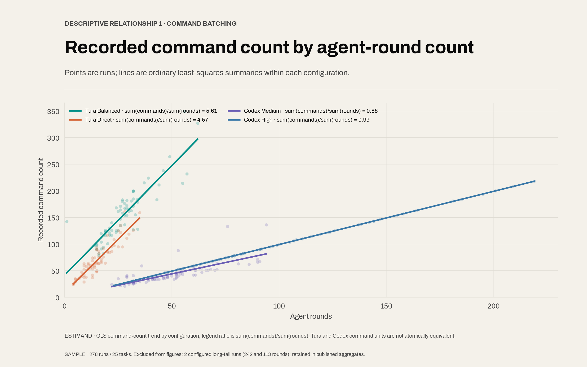
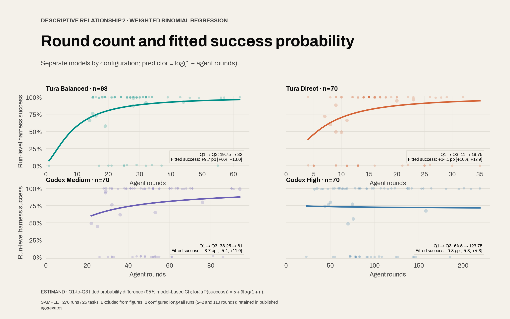
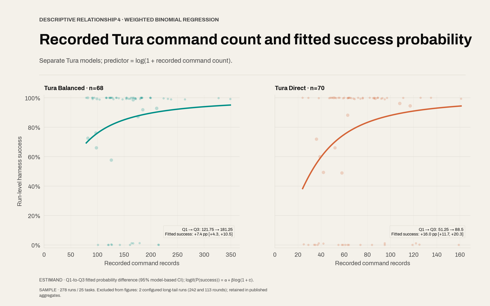

# Current Benchmark Evidence Record

Status: July 2026 four-configuration analysis, with August 2026 MCP workflow pilot

## 1. Analysis scope

This report compares four agent configurations across 280
published runs. Most charts use 278 runs because two unusually long Tura
Balanced traces would compress the visible range. A plausible reason for those
long traces is task-specific stopping behavior, but this report does not assume
that explanation is true. This record reports the current DeepSWE and rewrite
results for Tura Balanced
High, Tura Direct High, Codex CLI Medium, and Codex CLI High. It separates
configuration-level aggregates from cross-run regression analyses. Regression
coefficients are descriptive associations unless a causal design is explicitly
stated; no causal design is used here.

A separate August 2026 pilot covers 90 stateful MCP workflow runs: ten tasks,
three configurations, and three replicates, all using GPT-5.6 SOL at Low
reasoning. The MCP pilot has a different task contract, reasoning setting, and
configuration matrix. It is reported in Section 3.3 and is not added to the 280
engineering runs, the 278-run relationship population, or any 25-task aggregate.

Three analysis populations are used for the July engineering matrix:

| Population                         | Tasks |       Runs | Use                                                                                                      |
| ---------------------------------- | ----: | ---------: | -------------------------------------------------------------------------------------------------------- |
| Published result population        |    25 |        280 | Configuration score, token, round, and cost aggregates                                                   |
| Cross-run relationship population  |    25 |        278 | Figures 1-7 and their fitted models                                                                      |
| Submitted-code observed population |    25 | 272 of 278 | All-harness code-size analysis; 206 runs across 19 outcome-varying tasks identify the pooled coefficient |

The 278-run relationship population excludes two Tura Balanced observations
with more than 90 rounds: 113 rounds for `quill-shared-toolbar-focus` and 242
rounds for `dynamodb-toolbox-conditional-attribute-requirements`. The threshold
is applied uniformly to every statistical figure. Both observations remain in
the published result population and configuration-level aggregate tables. The
exact exclusions are recorded in
[`excluded-runs.csv`](../assets/model-run-statistics/excluded-runs.csv).

## 2. Configuration and provenance

The comparison is not a clean A/B test: the two Codex
rows differ in both build and reasoning effort, and the runtimes record commands
differently. Those implementation differences may explain part of the observed
gaps, so the formal report treats configuration names as bundles rather than as
single isolated mechanisms. The exact configurations and source populations are:

| Configuration    | Runtime/build                    | Model       | Reasoning | Published runs | Relationship runs |
| ---------------- | -------------------------------- | ----------- | --------- | -------------: | ----------------: |
| Tura Balanced    | Published Tura runtime           | GPT-5.6 SOL | High      |             70 |                68 |
| Tura Direct      | Published Tura runtime           | GPT-5.6 SOL | High      |             70 |                70 |
| Codex CLI Medium | Locally instrumented Codex build | GPT-5.6 SOL | Medium    |             70 |                70 |
| Codex CLI High   | Official Codex CLI `0.144.1`     | GPT-5.6 SOL | High      |             70 |                70 |

All published Tura DeepSWE runs used Tura's Bash surface (`tura exec bash
--json`). Bash is part of the named DeepSWE configuration because disabling it
can severely impair repository exploration, editing, and verification; a Tura
DeepSWE run without Bash is not comparable with these results.

DeepSWE observations come from six canonical reports under
[`results/debug`](../results/debug/): three reports containing Tura Balanced,
Tura Direct, and Codex Medium, and three reports containing Codex High. Rewrite
observations come from the 30-run
[`report-20260710-gpt56-sol`](../results/rewrite/report-20260710-gpt56-sol/canonical-manifest.json)
and the 10-run
[`report-20260714-codex-cli-0.144.1-gpt56-sol-high`](../results/rewrite/report-20260714-codex-cli-0.144.1-gpt56-sol-high/canonical-manifest.json).

The MCP workflow observations come from the schema-validated
[`report-mcp-workflow-gpt56-sol-low-20260809`](../results/mcp/report-mcp-workflow-gpt56-sol-low-20260809/manifest.json)
manifest. It records 90 completed runs across Tura Balanced, Tura Direct, and
Codex CLI, with three replicates per task and configuration. All runs use
GPT-5.6 SOL Low and the default service tier. Each task uses a run-scoped mock
service over real MCP JSON-RPC stdio; the mock server, scenario, verifier,
normalized provider calls, MCP trace, final state, and retained workspace are
published with the run. These are deterministic contract tests, not live
vendor-account tests.

Codex Medium used a locally instrumented build to retain command, timing, and
provenance fields. Its per-round contracts do not disclose input/output token
components; run-level aggregate usage is therefore the token source. Codex High
used the unmodified official `0.144.1` release. Build and reasoning effort are
not held constant between the two Codex configurations.

Acquisition reads canonical manifests, normalized harness contracts, aggregate
usage contracts, and contiguous round indexes directly from the published run
directories. No score, token component, command count, or missing source body is
reconstructed from narrative agent summaries. The local Codex modification is
therefore relevant only to Medium command/provenance instrumentation; High data
come from the official `0.144.1` publication path.

Retries are permitted only when an environment or provider failure invalidates
the attempt. A declared task timeout, agent non-zero exit, or agent-reported
failure is retained as experimental behavior and is not retried. One Codex
Medium rewrite run has unavailable usage; token and cost aggregates are observed
totals without imputation.

## 3. Configuration-level results

Tura uses fewer aggregate rounds and tokens in this test
set, while Tura Balanced also records the highest pass totals. One possible
explanation is a different allocation of work per round; another is that build,
reasoning, and runtime behavior jointly change when an agent stops. The aggregate
tables alone cannot separate these explanations. The following DeepSWE and
rewrite tables use all 280 published engineering observations and report the
configurations as observed, including the two Tura Balanced
long-tail observations excluded from relationship models.

### 3.1 DeepSWE

Tura Balanced passes 48 of 60 tasks with fewer total
rounds and tokens than either Codex configuration. A plausible hypothesis is
that it completes more useful work per recorded round, but task interaction,
runtime batching, and stopping behavior are competing explanations. Aggregate
DeepSWE outcomes are:

| Configuration      | Passes | Pass rate | Observed tokens | Rounds | Estimated cost |
| ------------------ | -----: | --------: | --------------: | -----: | -------------: |
| Tura Balanced High |  48/60 |     80.0% |     229,695,477 |  2,017 |       $221.138 |
| Tura Direct High   |  39/60 |     65.0% |      75,108,167 |    969 |        $99.620 |
| Codex CLI Medium   |  38/60 |     63.3% |     333,538,349 |  3,140 |       $257.173 |
| Codex CLI High     |  36/60 |     60.0% |     455,742,296 |  6,074 |       $327.483 |

Codex High records 36 passes and Codex Medium records 38. Codex High also
records 2,934 additional rounds and 122,203,947 additional observed tokens.
Because build and reasoning effort differ, this contrast does not identify an
isolated reasoning-effort effect.

### 3.2 Rewrite

Rewrite success rates are close for Tura Direct and both
Codex settings, while Tura Balanced is higher and uses fewer rounds than Codex.
A plausible hypothesis is that its interaction strategy helps on these five
tasks, although ten runs per configuration are too few to isolate a mechanism.
The assertion-weighted micro rate is `sum(passed) / sum(checks)`. The task macro
first pools the two replicates within each task and then assigns equal weight to
the five task-level rates.

| Configuration      | Harness checks | Micro rate | Task macro | Observed tokens | Rounds | Estimated cost |
| ------------------ | -------------: | ---------: | ---------: | --------------: | -----: | -------------: |
| Tura Balanced High |        389/472 |      82.4% |      84.2% |      24,997,927 |    229 |        $35.609 |
| Tura Direct High   |        353/472 |      74.8% |      77.4% |       8,368,639 |    123 |        $17.806 |
| Codex CLI Medium   |        351/472 |      74.4% |      76.4% |      48,979,410 |    425 |        $43.658 |
| Codex CLI High     |        352/472 |      74.6% |      77.8% |      63,348,476 |    726 |        $52.031 |

The Codex micro-rate difference is 0.2 percentage points. Codex High records
301 additional rounds and 14,369,066 additional observed tokens. This is a
configuration contrast, not an effort-only estimate.

### 3.3 MCP workflow pilot

The MCP workflow pilot records 84 passes in 90 completed runs. Direct passes
all 30 runs, Balanced passes 29, and Codex CLI passes 25. The cost column is an
API-equivalent estimate from recorded request-level usage and published
GPT-5.6 SOL rates; it is not a Codex subscription billing statement.

| Configuration | Passes | Pass rate | Requests | Observed tokens | Estimated cost |
| --- | ---: | ---: | ---: | ---: | ---: |
| Tura Direct | 30/30 | 100.0% | 108 | 1,876,781 | $4.664 |
| Tura Balanced | 29/30 | 96.7% | 124 | 2,374,741 | $5.149 |
| Codex CLI | 25/30 | 83.3% | 233 | 5,475,298 | $6.810 |
| **Total** | **84/90** | **93.3%** | **465** | **9,726,820** | **$16.623** |

All six failures are evaluation failures rather than infrastructure-invalid
runs. MCP initialization and schema discovery passed, while the required-tool,
dependency-order, and final-state checks failed together. The failures are one
Balanced run on `workflow-event-promo-kit`; one Codex run each on
`workflow-invoice-email-followup` and `workflow-recruiting-interview-pack`; and
all three Codex runs on `workflow-social-thumbnail-approval`. Direct has no
failure in this pilot.

Cache input is a subset of input, and reasoning tokens are a subset of output;
neither subset is added twice to the total. Across the batch, 7,711,744 of
9,619,166 input tokens are cached, an 80.2% cache hit rate under the manifest's
definition. The matrix is too small and too narrow to identify a runtime
mechanism or generalize to live services, other models, or other reasoning
levels.

## 4. Cross-run relationship models

Longer traces usually coincide with more recorded work,
more tokens, and—except for Codex High—a higher fitted success probability over
the middle half of each configuration's data. A plausible explanation is that
some extra rounds are productive diagnosis and verification; the competing
explanation is that difficult tasks both run longer and finish differently. The
models below describe associations in the filtered
relationship population; they are not estimates of what would happen if a round
budget were experimentally increased. Figures 1-5 use the 278-run relationship
population. Harness outcomes are
represented as `passed_i` successes from `checks_i` trials. Model-based
intervals condition on the stated regression specification and do not account
for all task-, configuration-, or replicate-level dependence.

### 4.1 Command-count density per agent round

A Tura round contains about four to six recorded command
items on average, whereas a Codex round contains about one normalized tool
record. The likely explanation is batching plus different instrumentation, not
that one runtime necessarily performs four times as much semantic work. The
aggregate statistic and within-configuration fits are:

The aggregate command-density statistic is
`sum(recorded commands) / sum(agent rounds)`: 5.61 for Tura Balanced, 4.57 for
Tura Direct, 0.88 for Codex Medium, and 0.99 for Codex High. Ordinary
least-squares lines summarize command count against round count within each
configuration.

  

_Figure 1. Points are runs from the 278-run relationship population after
excluding two Tura Balanced observations above 90 rounds (113 and 242), both
retained in published aggregates. Tura counts constituent `command_run`
commands; Codex counts normalized tool-command records. The ratio and OLS
coefficient therefore describe runtime-specific command records, not a common
atomic-work unit._

The observed slopes are approximately four recorded commands per additional
round for both Tura configurations and approximately one for both Codex
configurations. This is consistent with Tura's runtime recording multiple
constituent commands from a batched interaction, but the instrumentation
boundary is also part of the contrast. The result does not establish that Tura
performs four times as much work. A mechanism test would map both runtimes to a
common semantic command ontology, or count comparable operating-system process
invocations, before estimating a batching effect.

### 4.2 Round count and fitted success probability

From the first to the third round-count quartile, fitted
success rises for Tura Balanced, Tura Direct, and Codex Medium. Codex High is
essentially flat. Extra diagnosis or verification may help in the first three
configurations, while harder tasks and different stopping rules may also produce
the same pattern. The four small panels use the same visual language as the
earlier all-configuration round/success chart: run-level harness ratios are
shown as points and each configuration has its own fitted curve. The Q1-to-Q3
contrast is printed inside the lower-right corner of its corresponding panel.

Each configuration is estimated separately:

`logit(P(success_i)) = α + β log(1 + rounds_i)`.

The reported estimand is the fitted probability at the configuration-specific
third quartile of rounds minus the fitted probability at its first quartile.

| Configuration    |  Round Q1 to Q3 | Estimated probability difference | 95% model-based CI |
| ---------------- | --------------: | -------------------------------: | -----------------: |
| Tura Balanced    |  19.75 to 32.00 |                          +9.7 pp |   +6.4 to +13.0 pp |
| Tura Direct      |  11.00 to 19.75 |                         +14.1 pp |  +10.4 to +17.9 pp |
| Codex CLI Medium |  38.25 to 61.00 |                          +8.7 pp |   +5.4 to +11.9 pp |
| Codex CLI High   | 64.50 to 123.75 |                          -0.8 pp |    -5.8 to +4.3 pp |

  

_Figure 2. The 278-run relationship population excludes the two declared Tura
Balanced observations above 90 rounds (113 and 242), retained in published
aggregates. Marker area is proportional to harness check count. The estimates
pool heterogeneous tasks within configuration. Task difficulty, stopping rules,
and unresolved failures can affect both rounds and outcome; β is not a causal
round-budget effect._

The Q1-to-Q3 fitted differences are positive for Tura Balanced, Tura Direct,
and Codex Medium, whereas the Codex High estimate is near zero and its interval
includes both directions. One compatible explanation is that additional rounds
within the first three configurations often coincide with further diagnosis,
implementation, or verification, while the longer Codex High traces contain
less incremental outcome information over their observed range. The model does
not distinguish productive reinvestment from harder tasks simply requiring more
rounds. A controlled test would randomize round caps within task and
configuration, retain censored runs, and estimate task-stratified marginal
effects.

### 4.3 Token components and priced cost components

Output is a small share of token volume for every
configuration but a much larger share of estimated cost, especially for Tura.
The most direct hypothesis is the declared 6x price premium of output over
uncached input, combined with different output/context allocations. This is a
cost-composition observation, not an efficiency ranking. The figure places token
composition and cost composition side
by side, with four compact rows so every configuration is visible at the same
height.

For each configuration, token shares and estimated-cost shares are computed from
the included run-level components. Estimated cost is
`(5U + 0.5K + 30O) / 1,000,000`, where `U`, `K`, and `O` are uncached input,
cached input, and output tokens.

| Configuration    | Output share of tokens | Output share of estimated cost |
| ---------------- | ---------------------: | -----------------------------: |
| Tura Balanced    |                  1.17% |                         31.98% |
| Tura Direct      |                  1.77% |                         37.64% |
| Codex CLI Medium |                  0.34% |                         12.80% |
| Codex CLI High   |                  0.41% |                         17.00% |

  

_Figure 3. Shares use the 278-run relationship population after excluding the
two declared Tura Balanced observations above 90 rounds (113 and 242), retained
in published aggregates. The difference is a cost-allocation contrast under the
declared price schedule; it is not an efficiency or quality estimand._

Tura output tokens comprise 1.17%-1.77% of observed tokens, compared with
0.34%-0.41% for Codex, but output accounts for 31.98%-37.64% of Tura estimated
cost because the declared output rate exceeds both input rates. The contrast is
consistent with different allocations between generated reasoning/action text
and repeated context input. It does not show that either allocation is
intrinsically more efficient: outcome, task mix, caching, and pricing all enter
the comparison. A robustness analysis should recompute shares under alternative
price schedules and compare matched tasks at fixed harness outcome.

### 4.4 Tura command count and fitted success probability

Within both Tura settings, runs with more recorded
commands have higher fitted success over the middle half of the command-count
range. Broader implementation or verification is one possible explanation, but
command count also tracks duration, difficulty, and the decision to keep going.
The command unit is comparable only within the normalized Tura
contracts, so Codex is deliberately excluded from this model.

For each Tura configuration, the model is
`logit(P(success_i)) = α + β log(1 + commands_i)`. Codex is excluded because its
normalized command record can encapsulate multiple shell commands and does not
share the Tura counting unit.

| Configuration | Command Q1 to Q3 | Estimated probability difference | 95% model-based CI |
| ------------- | ---------------: | -------------------------------: | -----------------: |
| Tura Balanced | 121.75 to 181.25 |                          +7.4 pp |   +4.3 to +10.5 pp |
| Tura Direct   |   51.25 to 88.50 |                         +16.0 pp |  +11.7 to +20.3 pp |

  

_Figure 4. The 278-run relationship population excludes the two declared Tura
Balanced observations above 90 rounds (113 and 242), retained in published
aggregates. The model does not distinguish implementation, investigation, and
verification commands. Task difficulty and run duration can jointly increase
command count and observed success; β is not a causal command effect._

Within each Tura configuration, the fitted probability is higher at the third
quartile of recorded commands than at the first; the estimated difference is
larger for Direct (+16.0 pp) than Balanced (+7.4 pp). This is compatible with
broader implementation or verification coverage, but command count is also a
proxy for run duration, task difficulty, and stopping behavior. It cannot be
read as the return from adding one more command. A follow-up should classify
commands by investigation, implementation, and verification, then randomize or
instrument batching policy while holding task and round budget fixed.

### 4.5 Round-count models for token volume, billed cost, and effective rate

More rounds bring more than proportional token growth,
while total cost generally grows more slowly than token volume. The resulting
average price per observed token falls with round count. A plausible explanation
is that later rounds replay a larger cached context; this lowers average token
price but does not make a longer run cheaper in total. Following the earlier
published SVG, both panels use log-log
axes and configuration-specific power laws: `tokens = a_T rounds^p_T` and
`cost = a_C rounds^p_C`. The effective-rate exponent is therefore
`p_C - p_T`; it is reported in the table rather than as a separate panel.

| Configuration    | Token-growth exponent `p_T` | Cost-growth exponent `p_C` | Effective-rate exponent `p_C - p_T` |
| ---------------- | --------------------------: | -------------------------: | ----------------------------------: |
| Tura Balanced    |                       1.474 |                      0.944 |                              -0.530 |
| Tura Direct      |                       1.397 |                      0.876 |                              -0.520 |
| Codex CLI Medium |                       1.240 |                      0.949 |                              -0.291 |
| Codex CLI High   |                       1.382 |                      1.050 |                              -0.332 |

All four token exponents exceed 1, indicating superlinear token growth over the
observed range. Three cost exponents are below 1; Codex High is the near-linear
exception at 1.050. Because `p_C - p_T` is negative in every configuration, the
effective billed rate decreases with round count in each fitted configuration.

  

_Figure 5. The 278-run relationship population excludes the two declared Tura
Balanced observations above 90 rounds (113 and 242), retained in published
aggregates. Panel A shows total token volume and Panel B shows total estimated
billed cost. Points are runs; lines are configuration-specific power-law fits.
The fitted exponents summarize elasticity over the observed range and are not a
universal long-run law or a causal round-budget effect._

The gap between the token and cost exponents is consistent with later rounds
replaying more cached input: token volume can accelerate while billed cost stays
near linear. Total cost still increases with rounds in every configuration. A
stronger specification would estimate within-task curves and repeat the fits
under alternative cache-price schedules.

## 5 Submitted production-code volume and harness success

Submitted production-code volume has a positive within-task association with
run-level harness success: after centering `log(1 + additions)` on each task's
median and scaling by the pooled within-task standard deviation, a one-standard-
deviation increase corresponds to an estimated +8.1 percentage-point success
difference in the pooled task-fixed-effects model and +9.2 points after also
adjusting for configuration. The DeepSWE-only result is similar, while the much
smaller rewrite-only estimate is imprecise. These models use 206 observed-code
runs across the 19 tasks with outcome variation, give every run equal weight,
cluster uncertainty by task, leave six missing source bodies missing rather than
coding them as zero, and describe association rather than a causal return to
writing more code.

| Model | Runs / tasks | Success difference per within-task SD (95% CI) | Odds ratio (95% CI) | Task-clustered p-value |
| --- | ---: | ---: | ---: | ---: |
| Pooled, task fixed effects | 206 / 19 | +8.1 pp (+2.1 to +14.2) | 1.62 (1.12 to 2.34) | 0.013 |
| DeepSWE, task fixed effects | 178 / 15 | +8.4 pp (+1.7 to +15.0) | 1.65 (1.09 to 2.49) | 0.021 |
| Rewrite, task fixed effects | 28 / 4 | +4.9 pp (-2.4 to +12.1) | 1.33 (0.87 to 2.02) | 0.122 |
| Pooled, task and configuration fixed effects | 206 / 19 | +9.2 pp (+2.2 to +16.3) | 1.78 (1.14 to 2.78) | 0.014 |

## 6. Identification limits

The benchmark can compare the four complete
configurations, but it cannot tell which individual feature caused a difference.
The likely contributors—batching, context handling, prompts, build, and
reasoning effort—change together or are measured differently. The design
limitations are that the configuration matrix does not isolate compact-context
behavior, command
batching, operation-manual instructions, backward-reasoning instructions, or
reasoning effort. Cross-task-group differences in rounds and recorded command
counts provide descriptive signals, but no component-specific causal estimate.
A crossed ablation would need to hold build, task revision, model, reasoning
effort, timeout, service tier, network policy, and retry policy constant while
varying one mechanism.

Additional limitations are the curated task sample, correlated replicates,
heterogeneous harness granularity, six missing rewrite source bodies, one
missing usage record, and the Codex build/effort boundary. Model-based intervals
reported here do not resolve those design limitations.

## 7. Audit and reproducibility boundaries

[Benchmark issue #1](https://github.com/Tura-AI/benchmark/issues/1) identified
five evidence boundaries that do not change the recorded outcomes but do limit
the claims that can be made from them.

- The managed DeepSWE checkout defaults to upstream commit
  `a40d7298b18999c2d9b0ded7d6928e3ee26b5524`, but the July per-run grader
  metadata names the `v1.1` tag and does not retain a resolved verifier commit
  plus container-image digest. The task base and recorded verdict are
  inspectable; bit-for-bit grader identity is not fully demonstrated by the
  published contract.
- DeepSWE verifier code and hidden fixtures remain upstream. The receipt bundle
  permits inspection of the submitted patch and reward, but this repository
  alone cannot re-derive every reward from public fixtures.
- The published schemas do not apply one universal start-state manifest and
  automated off-task-state diff across DeepSWE, rewrite, and MCP workflows.
  Retained workspaces, patches, traces, and final state support manual audit but
  are not a general scored guard against unrelated damage.
- The rewrite suite does not publish one known-good target build passing every
  final harness. Pinned source behavior and individual assertions support the
  checks, but complete harness satisfiability has not been demonstrated by a
  retained reference run.
- Tura-AI develops Tura, owns this benchmark, defines the Tura configurations,
  and publishes comparisons against Codex. This direct conflict of interest is
  not removed by open artifacts; independent reproduction remains stronger
  evidence than a project-run result.

The MCP pilot improves local inspectability because its task scenarios, mock
server, verifier, MCP traces, state, and normalized agent records are published
together. It still tests deterministic mocks rather than live services, and its
five-check score does not claim to detect every unrelated workspace mutation.

## 8. Conclusion

Tura records fewer rounds, batches more command records
per round, and allocates a larger cost share to output. Three configurations show
a positive round/success association; Codex High is flat. Token volume grows
faster than billed cost, and more submitted production code is associated with
higher within-task success. These are patterns to test, not causal verdicts. On
the published 280-run population, Tura configurations record fewer aggregate
rounds than the Codex configurations, and Tura command-density ratios are higher
under the runtime-specific command definitions. In the 278-run relationship
population, the Q1-to-Q3 fitted success-probability differences are positive for
both Tura configurations and Codex Medium, while the Codex High interval includes
zero. Token-component shares show a larger output allocation for both Tura
configurations under the declared pricing schedule. Configuration-specific
token-volume exponents are all greater than 1, billed-cost exponents stay much
closer to 1, and the implied effective-rate exponents are negative.

Across all harness tasks with outcome variation, submitted production-code
volume has a positive task-adjusted association with run-level success, and the
association remains positive after configuration adjustment. The rewrite-only
estimate is imprecise. None of these analyses identifies a component-level or
code-volume causal effect.

Batching, cached-context reuse, productive extra diagnosis, and broader
implementation coverage are all compatible with parts of the evidence, but none
is isolated by this design.

The separate MCP workflow pilot records 84 passes in 90 completed runs: 30/30
for Direct, 29/30 for Balanced, and 25/30 for Codex CLI. Direct also records the
fewest requests, observed tokens, and estimated API-equivalent cost in this
pilot. These are configuration-level observations on ten deterministic mock
workflows at Low reasoning, not a live-service result or a component-level
causal estimate.
