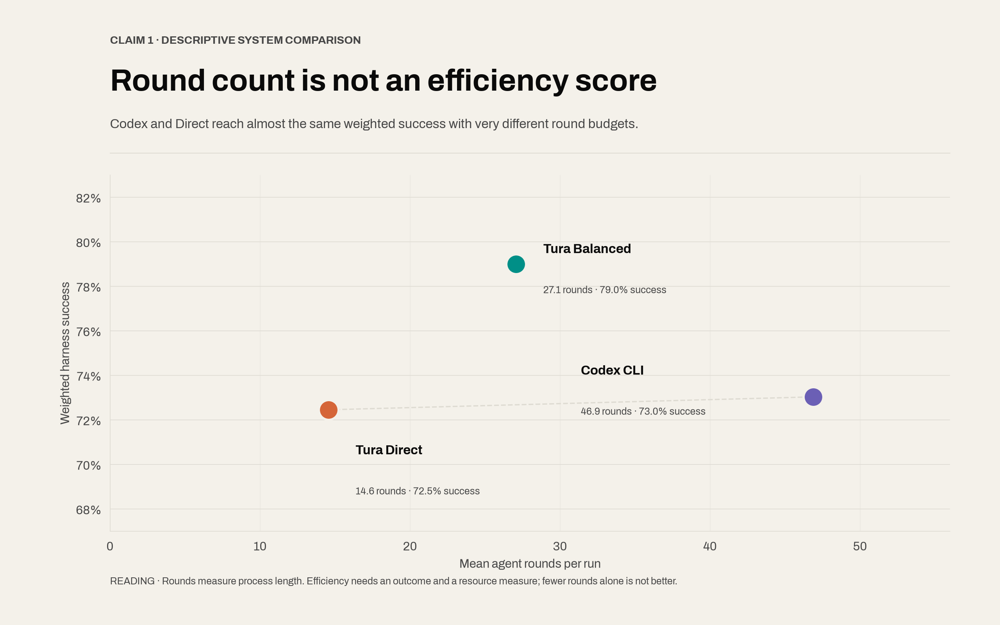
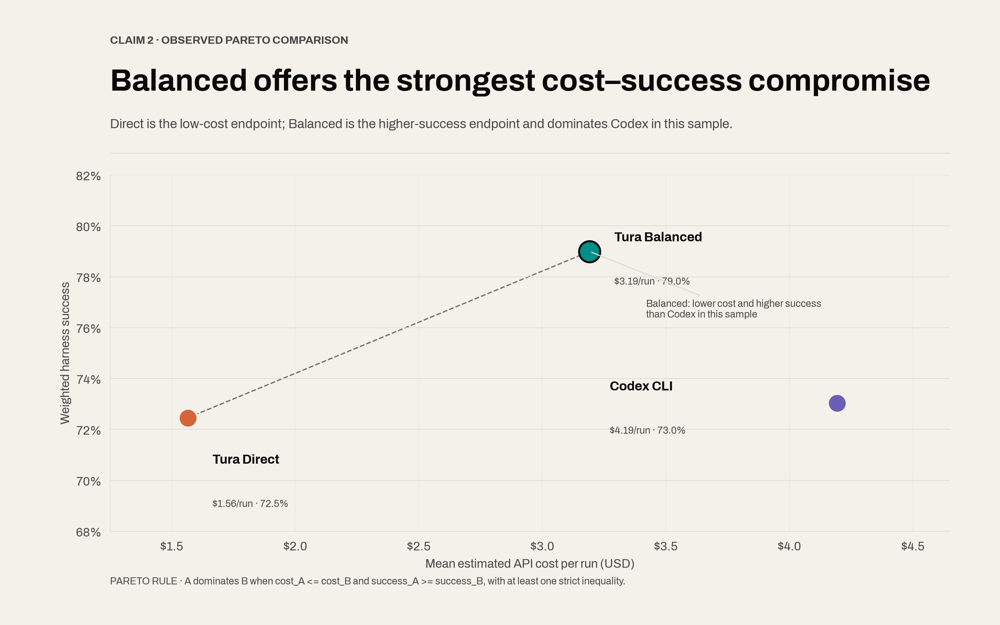
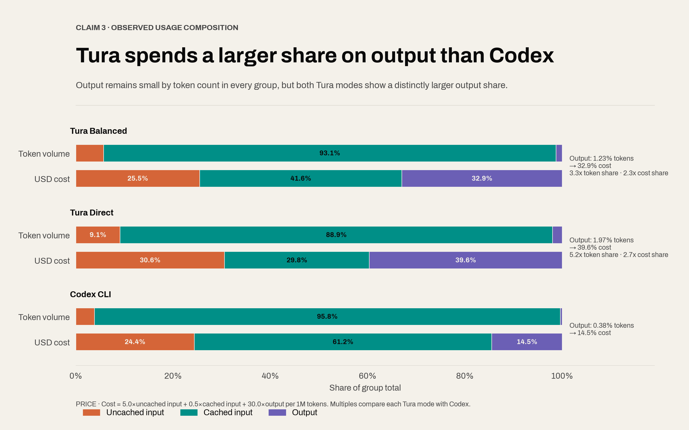
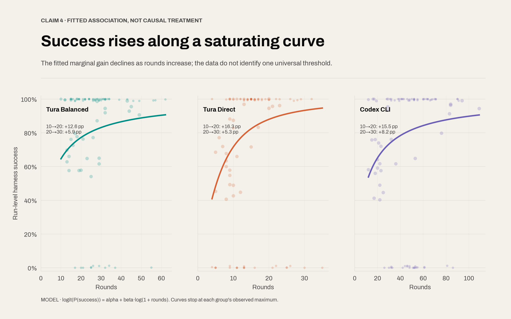
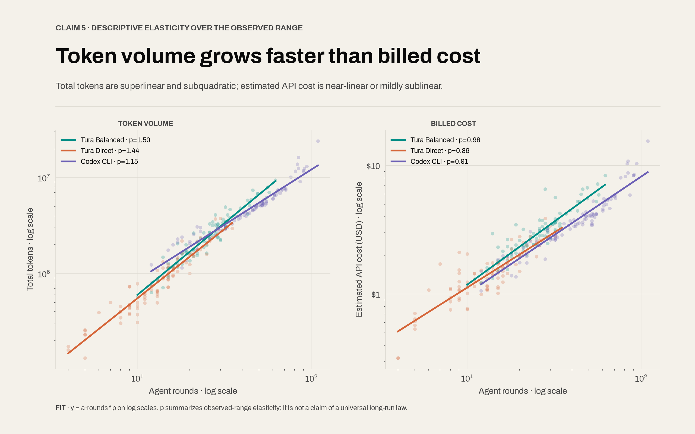

# Current Benchmark Test-Set Record

Status: public evidence record for the July 2026 published artifacts

This record states what the current Tura benchmark data proves, how the data
was collected and retained, and where the comparison is not yet controlled
enough to support a causal claim. It is intentionally stricter than a product
summary. A result is stated confidently only when the published artifacts can
be recomputed or directly inspected.

The report evaluates the strategy-level proposition described in the
[Tura agent repository](https://github.com/Tura-AI/tura): architectural savings
from fewer repeated-context model calls can either be retained as lower token
and round use or reinvested in deeper reasoning, investigation, and
verification. The public [benchmark article](https://turaai.net/benchmark)
presents the cost-versus-harness-score view; the numbers and limitations in
this report are grounded in the canonical artifacts in the
[Tura Benchmark repository](https://github.com/Tura-AI/benchmark), not inferred
from the article.

## 1. Scope and evidence levels

The current record covers three different evaluation surfaces:

| Surface                 |                            Published observations | Evaluation                                          |
| ----------------------- | ------------------------------------------------: | --------------------------------------------------- |
| DeepSWE v1.1 subset     | 20 tasks x 3 agents x 3 replicates = 180 sessions | Official binary verifier                            |
| Rewrite subset          |   5 tasks x 3 agents x 2 replicates = 30 sessions | Task-specific stable multi-item harnesses           |
| Design/front-end subset |    2 tasks x 2 agents x 2 replicates = 8 sessions | Artifact and process audit; no scalar quality score |

The DeepSWE numbers are recomputed from the 180 published `summary.json` and
`source-harness-report.json` files under the three
[`results/debug`](../results/debug/) reports. Rewrite scores and usage totals are
recomputed from the 30-run
[`canonical-manifest.json`](../results/rewrite/report-20260710-gpt56-sol/canonical-manifest.json)
and can be traced to each run's normalized harness report. The design findings
come from the eight archived [`design-run.json`](../results/design/) contracts,
their HTML workspaces, and their recorded tool calls. These evidence types are
not interchangeable: verifier and harness results support quantitative
capability claims; eight unblinded design runs support concrete artifact and
process findings, not statistical generalization.

The task definitions, selection method, and reporting rules are documented in
the [benchmark methodology](benchmark-methodology.md),
[`tasks/debug/deep-swe-v1.1`](../tasks/debug/deep-swe-v1.1/),
[`deep_swe/select_tasks.py`](../deep_swe/select_tasks.py), and the canonical
task declarations. The executable rerun path is documented in the repository
[`README`](../README.md).

## 2. What was run

### 2.1 DeepSWE cohort

The fixed subset contains 20 DeepSWE v1.1 tasks: four each in Go, Python,
TypeScript, Rust, and JavaScript, and five in each declared difficulty band.
Each agent configuration receives the same task ID and official instruction,
starts from the task's pinned environment, runs without task-container network
access, and is evaluated by the corresponding official verifier.

The published configurations are:

| Configuration | Model       | Reasoning effort | Sessions |
| ------------- | ----------- | ---------------- | -------: |
| Codex CLI     | GPT-5.6 SOL | Medium           |       60 |
| Tura Balanced | GPT-5.6 SOL | High             |       60 |
| Tura Direct   | GPT-5.6 SOL | High             |       60 |

The matrix used the default service tier, bounded 90-minute agent runs, and
isolated workspaces. Tura was routed through its normal runtime and Bash command
surface. The same 20 task IDs appear in each of the three published replicates.

### 2.2 Rewrite cohort

The rewrite subset contains four Rust-to-Python CLI source ports (`eza`,
`nushell`, `xsv`, and `zip-password-finder`) plus one benchmark-owned HTML
reference rebuilt as a TypeScript/TanStack Start full-stack application. Each
task was run twice with Codex CLI Medium, Tura Balanced High, and Tura Direct
High, all using GPT-5.6 SOL and the default service tier. This yields 10
sessions per configuration and 30 canonical sessions in total.

The CLI harnesses compare the rebuilt executable with the pinned reference for
exit status, stdout, and stderr across declared behavior families. The
full-stack harness checks application structure, visual fidelity, marketplace
flows, backend and database behavior, computed analytics, tests, browser
robustness, and code quality. The five harnesses contain 236 stable items per
replicate; because each configuration has two replicates, its pooled denominator
is 472 valid harness items.

### 2.3 Design and front-end cohort

The design subset contains an East Asian squid recipe slide deck and an
interactive Paris summer-temperature 3D experience. Each was run twice with
Codex CLI and twice with Tura Direct, using GPT-5.6 SOL High for both agents.
These runs therefore provide a same-model, same-effort process comparison,
separate from DeepSWE's High-versus-Medium configuration comparison.

## 3. Acquisition, persistence, and provenance

The benchmark keeps three evidence layers.

1. **Raw execution layer.** Provider events, untouched stdout/stderr, agent
   summaries, prompts, workspaces, patches, and verifier output are written
   beneath the local ignored `raw/` tree while the run is active.
2. **Normalized contract layer.** Provider-specific callbacks are converted to
   schema-defined rounds, tool calls, usage, agent summaries, and harness
   reports. Cumulative usage snapshots are deduplicated; absent usage remains
   absent rather than being estimated.
3. **Published layer.** Compact run manifests, normalized summaries, source
   agent summaries, source harness reports, patches, rewrite workspaces, and
   design workspaces are copied under [`results/`](../results/). Every published
   DeepSWE and rewrite run retains task ID, agent ID, model, effort, replicate,
   source batch, token usage, rounds, elapsed time, patch or workspace metadata,
   and verifier or harness outcome.

The collection and normalization boundaries are implemented in
[`deep_swe/run_matrix.mjs`](../deep_swe/run_matrix.mjs),
[`lib/generic_agent_cli.mjs`](../lib/generic_agent_cli.mjs), and the typed
contracts under [`src`](../src/). Published artifacts preserve the source
paths needed to trace a normalized record back to its physical execution
batch. Local absolute paths inside historical source records are provenance
captured at run time; they are not portability instructions.

No missing command, score, or token field is manufactured. A valid verifier
failure remains a failure. Retries and superseded physical attempts remain in
the raw attempt trees instead of being silently deleted; only the selected
published observation occupies a replicate slot.

## 4. What “same batch” does and does not mean

The comparison is cohort-aligned on the strongest stable boundaries:

- identical 20-task selection and task IDs;
- identical replicate numbers and 60-session denominator per agent;
- identical GPT-5.6 SOL model family and default service tier;
- pinned task environments and official verifier images;
- the same task-container network policy;
- the same normalized publication schema and scoring rule.

It is not literally one uninterrupted physical process. The final 180 records
were assembled from the initial matrix plus documented continuation and
recovery batches. This is acceptable because task identity, agent
configuration, replicate identity, source lineage, and verifier artifacts are
retained per observation. “Same cohort” is the accurate claim; “all 180 ran in
one process” is not.

## 5. Recomputed DeepSWE result

Every number in this table was recomputed from the 180 published summaries and
verifier reports. Tokens and rounds are aggregate observed totals; no outlier
was trimmed.

| Configuration      | Passes | Pass rate | Aggregate tokens | Rounds | Token change vs Codex | Round change vs Codex |
| ------------------ | -----: | --------: | ---------------: | -----: | --------------------: | --------------------: |
| Codex CLI Medium   |  38/60 |     63.3% |      333,538,349 |  3,140 |              baseline |              baseline |
| Tura Balanced High |  48/60 |     80.0% |      229,695,477 |  2,017 |                -31.1% |                -35.8% |
| Tura Direct High   |  39/60 |     65.0% |       75,108,167 |    969 |                -77.5% |                -69.1% |

These results support two strong statements.

1. In this published system configuration, Tura Balanced passed 10 more of 60
   verifiers than Codex CLI while using 31.1% fewer aggregate tokens.
2. Tura Direct used 77.5% fewer aggregate tokens and achieved a similar binary
   verifier result: 39 passes versus Codex CLI's 38.

They do not prove that one isolated runtime feature caused the difference.

## 6. Recomputed rewrite result

Every number in this section was recomputed from the 30 entries in the
[`canonical-manifest.json`](../results/rewrite/report-20260710-gpt56-sol/canonical-manifest.json).
Each configuration has two valid replicates of all five tasks. The assertion
micro rate is `sum(passed) / sum(total)` across those runs; the task macro
average first pools each task's two replicates, computes five task rates, and
then gives those five rates equal weight. Run percentages are never averaged.

| Configuration      | Harness checks | Micro rate | Task macro avg | Aggregate tokens | Token change vs Codex |
| ------------------ | -------------: | ---------: | -------------: | ---------------: | --------------------: |
| Codex CLI Medium   |        351/472 |      74.4% |          76.4% |       62,609,358 |              baseline |
| Tura Balanced High |        389/472 |      82.4% |          84.2% |       24,997,927 |                -60.1% |
| Tura Direct High   |        353/472 |      74.8% |          77.4% |        8,368,639 |                -86.6% |

The task-level pooled results make the heterogeneous harnesses visible instead
of hiding them inside one percentage:

| Rewrite task                                | Items per replicate | Codex CLI Medium | Tura Balanced High | Tura Direct High |
| ------------------------------------------- | ------------------: | ---------------: | -----------------: | ---------------: |
| `eza`                                       |                  52 |   74/104 (71.2%) |     93/104 (89.4%) |   83/104 (79.8%) |
| `nushell`                                   |                  48 |    59/96 (61.5%) |      71/96 (74.0%) |    61/96 (63.5%) |
| `prompt-gallery-tanstack-fullstack-rebuild` |                  63 |  123/126 (97.6%) |    121/126 (96.0%) |  119/126 (94.4%) |
| `xsv`                                       |                  55 |   60/110 (54.5%) |     68/110 (61.8%) |   54/110 (49.1%) |
| `zip-password-finder`                       |                  18 |    35/36 (97.2%) |     36/36 (100.0%) |   36/36 (100.0%) |

Balanced passed 38 more of 472 checks than Codex, an 8.1 percentage-point
micro-rate gain, while using 60.1% fewer aggregate tokens. Direct passed two
more checks than Codex while using 86.6% fewer tokens. Codex scored highest on
the TanStack rebuild; Balanced scored highest or tied highest on all four CLI
ports. These are results for the named High-versus-Medium configurations, not
an isolated measurement of runtime architecture or reasoning effort.

## 7. Anomalies and severe long tails were retained

The totals include behavior that makes Tura look worse. This is deliberate.

| Configuration | Agent timeouts/non-zero exits | Median elapsed | P95 elapsed | Maximum tokens | Maximum rounds |
| ------------- | ----------------------------: | -------------: | ----------: | -------------: | -------------: |
| Codex CLI     |                             1 |       21.8 min |    65.0 min |     12,473,035 |             91 |
| Tura Balanced |                             8 |       35.3 min |    90.0 min |     35,464,917 |            242 |
| Tura Direct   |                             0 |       19.1 min |    61.2 min |      3,762,598 |             35 |

The worst Tura Balanced run,
`dynamodb-toolbox-conditional-attribute-requirements` replicate 1, timed out at
90 minutes after 35.46 million tokens and 242 rounds. It remains in Balanced's
229.70 million-token aggregate. Seven other Balanced agent executions and one
Codex execution also reached a non-zero timeout outcome. Where a verifier could
still evaluate the resulting workspace, the verifier result remained the task
outcome rather than being discarded.

One Balanced replicate of that same DynamoDB task also has a timed-out,
non-zero harness report and no valid completed verifier result. The published
headline nevertheless keeps it as a failure in the 60-run denominator, yielding
48/60 = 80.0%. This is conservative for Tura but is a protocol deviation from
the stated rule that infrastructure-invalid verifier runs should be excluded
until rerun. Excluding it would produce 48/59 = 81.4%; this record retains the
published 80.0% to avoid retroactively improving the headline.

This is what retaining long-tail evidence means: aggregate efficiency is not a
median-only story, and operational failures are not removed because they are
embarrassing.

## 8. Why Tura High is compared with Codex Medium

This is a comparison of named product configurations, not a controlled
reasoning-effort experiment. Tura uses High because its Balanced mode is meant
to spend the runtime's saved round-trip budget on deeper investigation and
verification; Direct uses the same High model setting while minimizing the
execution path. Codex Medium is the selected reference configuration.

That choice makes the efficiency result harder, not easier, in one narrow
sense: despite requesting High reasoning, both Tura configurations consumed
fewer aggregate observed tokens than Codex Medium. It also creates an obvious
confound: High and Medium are not the same treatment, so the pass-rate gap
cannot be attributed to the agent runtime alone.

The correct interpretation is therefore:

- valid: the named Tura High systems achieved the published pass/token/round
  outcomes against the named Codex Medium system;
- invalid: High-versus-Medium by itself proves Tura's architecture caused the
  gain;
- still required: a crossed 2x2 matrix running Tura and Codex at both Medium
  and High under otherwise identical benchmark conditions.

## 9. Compact context and missing ablations

Tura's archived contracts contain explicit `task_status.compact_context`
interventions. The product README reports an average 2.6 rounds from those
events to resumed execution, compared with an estimated 5.4 rounds for Codex
from sharp input-token drops. Codex does not expose an equivalent event, so
those two measurements are asymmetric. They are useful operational evidence,
not a randomized causal ablation.

There is no completed experiment that disables `compact_context` while holding
the rest of Tura fixed. There is likewise no completed isolation of
`command_run`, backward-reasoning instructions, operation manuals, task-state
management, or provider-cache effects. Claims that any one of these features
alone caused the aggregate savings would exceed the evidence.

## 10. Design and front-end evidence

Across the eight same-model, same-High-effort design runs, Tura used fewer
tokens and turns while recording substantially more evidence-gathering and
verification actions.

| Task, two replicates per agent | Codex tokens | Tura tokens | Token change | Codex turns | Tura turns | Recorded tool actions, Codex / Tura |
| ------------------------------ | -----------: | ----------: | -----------: | ----------: | ---------: | ----------------------------------: |
| Squid recipe slides            |    2,312,139 |   1,465,194 |       -36.6% |          27 |         20 |                            21 / 164 |
| Paris temperature 3D           |    2,387,714 |   1,185,246 |       -50.4% |          27 |         21 |                            22 / 100 |

Across both tasks, Tura used 43.6% fewer tokens and 24.1% fewer turns while
recording 264 tool actions versus Codex's 43. Tool actions are not a quality
score. They do, however, show where Tura spent the saved model budget: the Tura
runs record 82 web-discovery calls, 24 media inspections, 25 image generations,
browser/Playwright checks, link probes, and responsive-state verification.
The Codex runs record no equivalent media inspection and no archived browser
capture review.

### 10.1 Squid recipe links

The four public HTML artifacts can be inspected directly:

- Codex CLI: [run 1](../results/design/east-asian-squid-recipes-slides/report-20260711-design-matrix/codex-cli-r01/workspace/index.html), [run 2](../results/design/east-asian-squid-recipes-slides/report-20260711-design-matrix/codex-cli-r02/workspace/index.html)
- Tura Direct: [run 1](../results/design/east-asian-squid-recipes-slides/report-20260711-design-matrix/tura-direct-r01/workspace/index.html), [run 2](../results/design/east-asian-squid-recipes-slides/report-20260711-design-matrix/tura-direct-r02/workspace/index.html)

A structural URL audit and a title-level content audit give two different,
important results:

The audit was rerun on 2026-07-12. Across Tura's 20 slots, the 15 unique recipe
URLs all returned HTTP 200 with matching page titles, and the 15 unique YouTube
IDs all resolved through `yt-dlp`. Availability is time-sensitive; the exact
dish-match counts below come from page and video titles, not status codes alone.

| Agent, two runs | Direct recipe/content pages | Exact-dish recipe pages | Search or broad index pages | Specific YouTube `watch` pages | Exact-dish video titles | YouTube search-result pages |
| --------------- | --------------------------: | ----------------------: | --------------------------: | -----------------------------: | ----------------------: | --------------------------: |
| Codex CLI       |                  8/20 (40%) |       not fully audited |                 12/20 (60%) |                           0/20 |                    0/20 |                20/20 (100%) |
| Tura Direct     |                20/20 (100%) |             18/20 (90%) |                        0/20 |                   20/20 (100%) |             18/20 (90%) |                        0/20 |

Thus the Codex decks do not satisfy the literal requirement for a working
YouTube cooking-video link: every video destination is a search-results page.
Tura's decks use resolvable, specific video pages in all 20 slots. Title-level
inspection confirms 18 exact-dish matches. Two run-1 videos are neighboring
evidence rather than exact matches: `Bi mu da kao` links to a braised
cuttlefish/pork/egg video, and `Hot-pot squid` links to a general hot-pot video.
The same run has two method-level recipe sources rather than exact squid-dish
sources: a chicken-and-shrimp dry-pot recipe and a general hot-pot guide. Tura
run 2 is 10/10 exact at this level for both recipe pages and video titles.

Sixty percent of Codex's nominal recipe sources are Google searches, site
searches, or broad recipe indexes rather than direct dish pages. Every Codex
video destination is a YouTube search-results page, so none satisfies the
literal request for a cooking-video link. The remaining eight direct Codex
recipe pages include some technique substitutions; they were not all promoted
to exact-dish matches in this audit.

This is a title/page-identity audit, not a blinded culinary replication study.
It verifies destination type and obvious dish identity; it does not prove that
every ingredient quantity or cooking step in the deck faithfully reproduces
the cited source.

The artifacts are published under
[`results/design/east-asian-squid-recipes-slides`](../results/design/east-asian-squid-recipes-slides/).

### 10.2 Paris 3D implementation and validation

The four public HTML artifacts can be inspected directly:

- Codex CLI: [run 1](../results/design/paris-summer-temperature-3d/report-20260711-design-matrix/codex-cli-r01/workspace/index.html), [run 2](../results/design/paris-summer-temperature-3d/report-20260711-design-matrix/codex-cli-r02/workspace/index.html)
- Tura Direct: [run 1](../results/design/paris-summer-temperature-3d/report-20260711-design-matrix/tura-direct-r01/workspace/index.html), [run 2](../results/design/paris-summer-temperature-3d/report-20260711-design-matrix/tura-direct-r02/workspace/index.html)

Both Tura artifacts implement an actual Three.js/WebGL scene with a
`PerspectiveCamera`, explicit camera position/look-at behavior, depth-aware
geometry, and rendering through `WebGLRenderer`. The archived Tura runs execute
real-browser checks, inspect desktop/tablet/mobile captures, verify WebGL
rendering and console state, and exercise year and metric selection. This is
direct evidence that the intended camera angle and interaction path were
validated, not merely written.

The Codex artifacts use CSS 3D transforms and stacked `z-index` layers. Public
inspection of those HTML pages found incorrect viewing angles and layer-order
problems that weaken the intended 3D reading. This is a disclosed human
artifact observation, not an automated harness score; readers can verify or
challenge it against the four links above. The archived Codex process records
syntax and disclosure checks but no equivalent real-browser screenshot review.

Tura's screenshot work is not inferred from a closing claim. Its published run
contracts record Playwright capture generation at 1440, 768, and 390 pixels,
three subsequent `read_media` inspections, WebGL and console checks, and
interaction assertions. The capture files themselves remained in the ignored
raw workspace rather than the published result tree. The durable public
evidence is therefore the run contract plus the final HTML, while future runs
should publish the captures alongside both agents' artifacts.

The artifacts are published under
[`results/design/paris-summer-temperature-3d`](../results/design/paris-summer-temperature-3d/).

## 11. How architecture savings support two budget strategies

The published configurations represent two strategy-level uses of the claimed
architecture advantage. Tura Balanced reinvests part of the reduced
model-context and round-trip budget in higher reasoning effort, investigation,
and verification. Tura Direct retains more of that advantage as lower token and
round use while still performing task verification. These are complete agent
policies, not isolated interventions.

The observed pattern is not “Tura does less.” Tura makes fewer model round
trips, batches independent commands into one structured execution step, and
keeps tool output attached to normalized rounds. The saved model-context budget
can then be spent on external work that does not require another full prompt
replay: repository search, source retrieval, generated assets, browser checks,
link validation, responsive captures, and test reruns.

DeepSWE shows the same distinction. Codex used 3,140 model rounds and 2,496
recorded commands. Balanced used 2,017 rounds but 10,149 commands; Direct used
969 rounds and 4,340 commands. Command counts are not comparable as atomic work
units because Tura's macro calls and Codex's shell calls have different
granularity. Still, the direction is unambiguous: lower model-round cost did
not come from avoiding execution and verification.

The causal mechanism remains a hypothesis until feature ablations are run.
The observed system-level fact is already strong: fewer aggregate model tokens
coexisted with more archived verification activity and, for Balanced, more
DeepSWE verifier passes. For Direct, the relevant question is different: how
much token, round, and cost reduction can be retained without an unacceptable
verified-outcome loss. The current near-comparison is descriptive because no
formal non-inferiority margin was predeclared.

## 12. Five cross-run descriptive relationships

The following five figures answer a different question from the untrimmed
publication totals in Sections 5–7. They examine cross-run relationships after
an explicit sensitivity filter: the two isolated Balanced observations above
90 rounds (113 and 242 rounds) and the one zero-token, usage-unavailable run
that did not execute are excluded. The source remains 270 debug and rewrite
runs; the explanatory sample contains 267 runs across the same 25 tasks. The
three exclusions are listed in
[`excluded-runs.csv`](../assets/model-run-statistics/excluded-runs.csv), and the
267 included observations are published in
[`run-level-data.csv`](../assets/model-run-statistics/run-level-data.csv).

This filtering does not replace the conservative headline aggregates. It keeps
the long tails visible in the public result while preventing three exceptional
records from setting the scale and functional shape of this separate
relationship analysis. All fitted curves below are descriptive associations,
not randomized treatment effects.

### 12.1 Round count is process length, not an efficiency score

Codex averaged 46.9 rounds and Direct averaged 14.6, yet their weighted harness
success rates were nearly the same: 73.0% and 72.5%. Balanced averaged 27.1
rounds and reached 79.0%. A round count alone therefore does not order systems
by efficiency. It measures process length; an efficiency comparison also needs
an outcome and at least one resource measure.

No arbitrary scalar efficiency score is imposed here. A system may use fewer
rounds because it batches work effectively, because it stops early, or because
it fails before completing the necessary work. The observed coordinates are
reported instead of collapsing those cases into one number.

### 12.2 Balanced is on the observed cost–success frontier

For agent group `g`, the plotted coordinates are

`C_g = sum(run cost) / N_g`

and

`S_g = sum(passed checks) / sum(total checks)`.

Balanced averaged $3.19 per run at 79.0% weighted success. Direct averaged
$1.56 at 72.5%, while Codex averaged $4.19 at 73.0%. Under the observed Pareto
rule, configuration `A` dominates `B` when `C_A <= C_B` and `S_A >= S_B`, with
at least one strict inequality. Balanced therefore dominates Codex in this
sample. Direct and Balanced form the two meaningful frontier endpoints: Direct
is cheaper, while Balanced buys a higher observed success rate.

Calling Balanced the strongest “compromise” is a decision interpretation, not
a universal optimum. A user who values minimum spend above the observed success
gap may rationally choose Direct. No monetary value per successful check was
predeclared.

### 12.3 Tura has a larger output share than Codex

Total tokens are not a unique dollar-cost measure because token classes have
different prices. Every run is repriced with the same recorded standard-tier
identity:

`cost_usd = (5.0 U + 0.5 K + 30.0 O) / 1,000,000`,

where `U` is uncached input, `K` is cached input, and `O` is output. Reasoning
tokens are already included in output tokens and are not charged twice.

Output is a small share of token count for all three groups, but the Tura shares
are materially higher than Codex's:

| Agent group   | Output share of tokens | Output share of cost | Token-share multiple vs Codex | Cost-share multiple vs Codex |
| ------------- | ---------------------: | -------------------: | ----------------------------: | ---------------------------: |
| Tura Balanced |                  1.23% |                32.9% |                          3.3x |                         2.3x |
| Tura Direct   |                  1.97% |                39.6% |                          5.2x |                         2.7x |
| Codex CLI     |                  0.38% |                14.5% |                          1.0x |                         1.0x |

The interpretation is comparative: Tura emits a larger output fraction than
Codex, and the 30-to-1 output-versus-cached-input price ratio magnifies that
difference in the bill. Cached input still dominates token volume in every
group. Total tokens remain useful for measuring context and system load, but
cost analysis must retain the uncached, cached, and output components.

### 12.4 Success follows a fitted saturation pattern

The success curves use a weighted binomial model,

`logit(P(success | n)) = alpha + beta log(1 + n)`,

or equivalently

`P(success | n) = sigmoid(alpha + beta log(1 + n))`,

where `n` is the run's round count and each run is weighted by its harness check
count. This shape rises quickly and then flattens by construction. The observed
fit shows the expected declining marginal association:

| Agent group   | Fitted gain, rounds 10→20 | Fitted gain, rounds 20→30 |
| ------------- | ------------------------: | ------------------------: |
| Tura Balanced |                  +12.6 pp |                   +5.9 pp |
| Tura Direct   |                  +16.3 pp |                   +5.3 pp |
| Codex CLI     |                  +15.5 pp |                   +8.2 pp |

The defensible conclusion is diminishing fitted association, not a universal
critical round. Task difficulty, stopping behavior, timeouts, and agent policy
all affect both round count and outcome. A causal threshold requires a
controlled experiment that randomly varies round budgets for the same tasks and
configurations.

### 12.5 Token volume and billed cost have different elasticities

For a common descriptive scale, both quantities are summarized over the
observed range with

`y(n) = a n^p`.

The exponent `p` is the fitted elasticity: a 1% increase in rounds corresponds
to an estimated `p`% increase in `y` within the sampled range.

| Agent group   | Total-token exponent `p` | Cost exponent `p` |
| ------------- | -----------------------: | ----------------: |
| Tura Balanced |                    1.498 |             0.981 |
| Tura Direct   |                    1.444 |             0.856 |
| Codex CLI     |                    1.152 |             0.910 |

Across the observed range, total token volume is therefore superlinear but
subquadratic, while billed cost is approximately linear or mildly sublinear.
The mechanism is consistent with the pricing identity and the data: cached
input represents 94.2% of Balanced input, 90.7% of Direct input, and 96.2% of
Codex input, and its share is higher among the longer-run half of every group.
Additional context tokens are increasingly likely to be discounted cache hits.

The power law is used here as a compact elasticity summary, not as a universal
long-run law. The competing two-parameter context-growth model,

`T(n) = nB + c n(n + 1) / 2`,

has similar leave-one-task-out error and is retained by the predeclared 5%
tolerance rule for all three groups. The data support “observed superlinear,
subquadratic growth”; they do not distinguish a permanent power law from a
quadratic process whose linear term remains material in the sampled range.

The figures, SVG sources, fitted summaries, and exact pricing assumptions are
published under
[`assets/model-run-statistics`](../assets/model-run-statistics/), with the five
claim-specific outputs under
[`claim-charts`](../assets/model-run-statistics/claim-charts/).

## 13. Limitations

- The DeepSWE subset is deterministic and stratified, not a random sample of
  all software work.
- Three replicates reduce stochastic noise but do not create 60 independent
  tasks; outcomes within a task and repository are correlated.
- The rewrite subset has only five heterogeneous tasks and two replicates. Its
  472 harness checks per configuration are not 472 independent tasks; both the
  task-macro and assertion-micro rates must remain visible.
- Four rewrite tasks cover Rust-to-Python CLI ports and one covers a single
  TanStack product shape, so the result does not generalize to arbitrary
  language pairs, frameworks, or application categories.
- High-versus-Medium confounds agent/runtime and effort.
- Compact-context and feature-level effects have not been ablated.
- Token totals measure observed provider usage, not a universal dollar cost;
  cache pricing and provider policy can change.
- The cross-run fits in Section 12 use an explicitly filtered 267-run
  sensitivity sample. They pool heterogeneous tasks and configurations, so
  fitted slopes and success curves are associations rather than causal response
  functions.
- The design sample has only two tasks and two replicates, no blinded reviewers,
  and no validated scalar quality rubric.
- A direct URL is not by itself proof of content relevance, and a successful
  page load is not proof of culinary accuracy.
- The Paris comparison lacks retained Codex screenshots, preventing a symmetric
  post-hoc visual inspection.
- A verifier can be imperfect. Passing the current harness proves conformance
  to that harness, not maintainability, security, or upstream acceptance.

## 14. Next experiments

1. Run the crossed Tura/Codex x Medium/High effort matrix with identical task,
   timeout, service-tier, and concurrency policies.
2. Ablate `command_run`, `compact_context`, backward-reasoning instructions,
   and operation-manual loading one at a time and in selected interactions.
3. Predeclare infrastructure-invalid handling, automatically enforce it, and
   publish both intent-to-run and valid-verifier denominators.
4. Report paired task-level confidence intervals and bootstrap sensitivity,
   not only pooled session percentages.
5. Expand rewrite coverage to additional source/target language pairs and
   full-stack product shapes while retaining task-level macro reporting.
6. Add a deterministic design integrity harness for link type, HTTP status,
   video-page identity, local assets, browser console state, viewport captures,
   WebGL availability, and interaction paths.
7. Add blinded multi-reviewer visual and editorial scoring with a predeclared
   rubric and inter-rater agreement.
8. Retain browser captures for every design agent so visual claims can be
   reviewed symmetrically after publication.

## 15. Repository and article citations

| Source                                                                                                                                         | Role in this report                                                                   |
| ---------------------------------------------------------------------------------------------------------------------------------------------- | ------------------------------------------------------------------------------------- |
| [Tura agent repository](https://github.com/Tura-AI/tura)                                                                                       | Architecture, orchestration, context-management, and strategy framing                 |
| [Public benchmark article](https://turaai.net/benchmark)                                                                                       | Public cost-versus-harness-score presentation                                         |
| [Tura Benchmark repository](https://github.com/Tura-AI/benchmark)                                                                              | Report source, task declarations, schemas, runners, and published evidence            |
| [Benchmark methodology](https://github.com/Tura-AI/benchmark/blob/main/doc/benchmark-methodology.md)                                           | Selection, scoring, normalization, reporting, and strategy-level interpretation rules |
| [DeepSWE replicate 1](https://github.com/Tura-AI/benchmark/blob/main/results/debug/report-deepswe-v1.1-gpt56-sol-local-r01/manifest.json)      | Canonical 60-session manifest for replicate 1                                         |
| [DeepSWE replicate 2](https://github.com/Tura-AI/benchmark/blob/main/results/debug/report-deepswe-v1.1-gpt56-sol-local-r02/manifest.json)      | Canonical 60-session manifest for replicate 2                                         |
| [DeepSWE replicate 3](https://github.com/Tura-AI/benchmark/blob/main/results/debug/report-deepswe-v1.1-gpt56-sol-local-r03/manifest.json)      | Canonical 60-session manifest for replicate 3                                         |
| [Rewrite canonical manifest](https://github.com/Tura-AI/benchmark/blob/main/results/rewrite/report-20260710-gpt56-sol/canonical-manifest.json) | Canonical 30-session rewrite scores, token totals, and computed costs                 |
| [Filtered run-level relationship data](../assets/model-run-statistics/run-level-data.csv)                                                      | 267-run explanatory sample used for Section 12                                        |
| [Claim-chart fitted summary](../assets/model-run-statistics/claim-charts/claim-chart-summary.json)                                             | Recomputed coordinates, composition shares, saturation gains, and scaling exponents   |

The agent repository and public article state the hypothesis and summarize the
result. The benchmark repository and manifests are the evidence sources used
for recomputation. None of these citations turns the current system-level
comparison into a feature-level ablation.

## Conclusion

The current evidence is sufficient to be unequivocal about the published
system-level result: on this fixed 20-task DeepSWE cohort, Tura Balanced passed
more verifiers with fewer aggregate tokens and rounds, while Tura Direct
matched the reference pass count within one run at a fraction of the token and
round budget. Severe Tura long tails and failures were retained rather than
trimmed. On the five-task rewrite cohort, Balanced achieved an 84.2% task-macro
average and 82.4% assertion-micro rate while using 60.1% fewer tokens than
Codex; Direct achieved 77.4% and 74.8% respectively while using 86.6% fewer
tokens. In the small same-effort design cohort, Tura also used fewer tokens
while preserving far more source, media, link, browser, and responsive
verification evidence.

The evidence is not sufficient to assign those gains to one feature or to call
the effort settings controlled. Those are limitations to test next, not reasons
to dilute the results that are already directly reproducible.

The filtered cross-run sensitivity analysis adds five descriptive observations:
round count alone is not an efficiency score; Balanced lies on the observed
cost-success frontier; Tura allocates a larger token and dollar share to output
than Codex; fitted success gains diminish with additional rounds; and discounted
cache reuse separates superlinear token growth from near-linear billed cost.
These observations sharpen the system-level result without turning correlation
into a feature-level causal claim.
