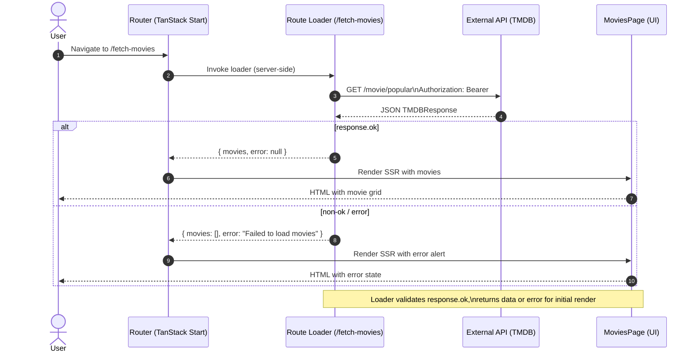

# Calling an external API using TanStack Start

Source: https://tanstack.com/start/v0/docs/framework/react/tutorial/fetching-external-api

=> {
    const response = await fetch(API_URL, {
      headers: {
        accept: 'application/json',
        Authorization: `Bearer ${process.env.TMDB_AUTH_TOKEN}`,
      },
    })

    if (!response.ok) {
      throw new Error(`Failed to fetch movies: ${response.statusText}`)
    }

    return response.json()
  },
)

export const Route = createFileRoute('/fetch-movies')({
  component: MoviesPage,
  loader: async (): Promise<{ movies: Movie[]; error: string | null }> => {
    try {
      const moviesData = await fetchPopularMovies()
      return { movies: moviesData.results, error: null }
    } catch (error) {
      console.error('Error fetching movies:', error)
      return { movies: [], error: 'Failed to load movies' }
    }
  },
})
```

_What's happening here:_

- `createServerFn()` creates a server-only function that runs exclusively on the server, ensuring our `TMDB_AUTH_TOKEN` environment variable never gets exposed to the client. The server function makes an authenticated request to the TMDB API and returns the parsed JSON response.
- The route loader runs on the server when a user visits /fetch-movies, calling our server function before the page renders
- Error handling ensures the component always receives valid data structure - either the movies or an empty array with an error message
- This pattern provides server-side rendering, automatic type safety, and secure API credential handling out of the box.

## Step 4: Building the Movie Components

Now let's create the components that will display our movie data. Add these components to the same `fetch-movies.tsx` file:

```tsx
// MovieCard component
const MovieCard = ({ movie }: { movie: Movie }) => {
  return (

      {movie.poster_path && (
        
      )}

  )
}

// MovieDetails component
const MovieDetails = ({ movie }: { movie: Movie }) => {
  return (
    <>
      ### {movie.title}

        {movie.overview}

{movie.release_date}
          ⭐️ {movie.vote_average.toFixed(1)}

  )
}
```

## Step 5: Creating the MoviesPage Component

Finally, let's create the main component that consumes the loader data:

```tsx
// MoviesPage component
const MoviesPage = () => {
  const { movies, error } = Route.useLoaderData()

  return (
    # Popular Movies

        {error && (

            {error}

        )}

        {movies.length > 0 ? (

            {movies.slice(0, 12).map((movie) => (

            ))}

        ) : (
          !error && (

              Loading movies...

          )
        )}

  )
}
```

### Understanding How It All Works Together



Let's break down how the different parts of our application work together:

1. Route loader: When a user visits `/fetch-movies`, the loader function runs on the server
2. API call: The loader calls `fetchPopularMovies()` which makes an HTTP request to TMDB
3. Server-Side rendering: The data is fetched on the server reducing the load on the client side
4. Component rendering: The `MoviesPage` component receives the data via `Route.useLoaderData()`
5. Rendering UI: The movie cards are rendered with the fetched data

## Step 6: Testing Your Application

Now you can test your application by visiting [http://localhost:3000/fetch-movies](http://localhost:3000/fetch-movies). If everything is set up correctly, you should see a grid of popular movies with their posters, titles, and ratings. Your app should look like this:


## Conclusion

You've successfully built a movie discovery app that integrates with an external API using TanStack Start. This tutorial demonstrated how to use route loaders for server-side data fetching and building UI components with external data.

While fetching data at build time in TanStack Start is perfect for static content like blog posts or product pages, it's not ideal for interactive apps. If you need features like real-time updates, caching, or infinite scrolling, you'll want to use [TanStack Query](/query/latest) on the client side instead. TanStack Query makes it easy to handle dynamic data with built-in caching, background updates, and smooth user interactions. By using TanStack Start for static content and TanStack Query for interactive features, you get fast loading pages plus all the modern functionality users expect.

## Media links

- <https://res.cloudinary.com/dubc3wnbv/image/upload/v1756512946/Screenshot_2025-08-29_at_5.14.26_PM_iiex7o.png>
